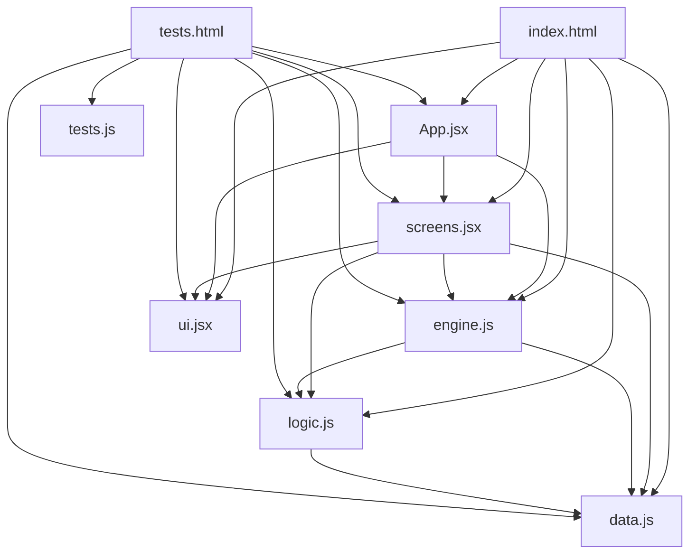

# Caribbean Pirates Game — Architecture Documentation

## 📌 Table of Contents

1. [Overview](#-overview)
2. [Architecture Diagram](#️-architecture-diagram)
3. [File Structure](#-file-structure)
4. [Core Components](#-core-components)
5. [Testing Infrastructure](#-testing-infrastructure)
6. [Data Flow](#-data-flow)
7. [State Management](#-state-management)
8. [Game Mechanics](#️-game-mechanics)
9. [Bug Fixes & Recent Changes](#-bug-fixes--recent-changes)
10. [Extensibility](#-extensibility)
11. [Future Improvements](#-future-improvements)
12. [Summary](#-summary)

---

# 🎯 Overview

Caribbean Pirates is a turn-based strategy game inspired by *Sid Meier's Pirates!*.

The architecture follows a modular, stateless design with clear separation of concerns:

- **Data:** Centralized constants (`ports`, `ships`, `factions`, etc.)
- **Logic:** Pure functions for combat, travel, missions, etc.
- **State:** Managed with `useReducer`
- **UI:** Reusable components in `ui.jsx`
- **Screens:** Game-specific views in `screens.jsx`

## Tech Stack

- **Frontend:** React 18
- **State Management:** `useReducer`
- **Styling:** Inline CSS
- **Build:** Babel (browser transpilation)
- **Storage:** `localStorage`
- **Testing:** Browser-native test harness

---

# 🏗️ Architecture Diagram



## Dependencies Flow

1. `index.html` loads all scripts in order.
2. `App.jsx` initializes state and renders screens.
3. Screens dispatch actions to `engine.js`.
4. `engine.js` uses `logic.js` for calculations.
5. All files reference `data.js` for constants.
6. `tests.html` loads all game files and test suites.

---

# 📁 File Structure

```text
📁 project/
├── index.html
├── data.js
├── logic.js
├── engine.js
├── ui.jsx
├── screens.jsx
├── App.jsx
├── tests/
│   ├── tests.html
│   └── tests.js
└── architecture.md
```

---

# 🧩 Core Components

## 1. data.js

### Purpose

Centralized game constants with **no logic**.

### Export

```js
window.D
```

### Main Data Structures

| Constant | Purpose |
|---|---|
| `PORTS` | Port definitions |
| `SHIPS` | Ship stats and costs |
| `FACTIONS` | Faction metadata |
| `UPGRADES` | Ship upgrades |
| `MISSION_POOL` | Mission templates |
| `RANDOM_EVENTS` | Random events |
| `STARTS` | Starting scenarios |
| `FACTION_RELATIONS` | Faction relationships |

### Design Principle

- Pure data
- No state mutation
- Global debug access

---

## 2. logic.js

### Purpose

Pure game mechanics functions.

### Export

```js
window.L
```

### Key Functions

| Function | Purpose |
|---|---|
| `resolveCombatAction` | Combat calculations |
| `travelDays` | Sailing duration |
| `generateMissions` | Mission generation |
| `triggerRandomEvent` | Event selection |
| `payCrewWages` | Wage calculation |
| `getShipStats` | Upgraded ship stats |
| `getEffectiveMorale` | Morale bonuses |
| `saveGame` | Save state |
| `loadGame` | Load state |

### Design Principle

- Pure functions
- No side effects
- Reusable logic

---

## 3. engine.js

### Purpose

Centralized state management.

### Export

```js
window.E
```

### Components

| Component | Purpose |
|---|---|
| `A` | Action constants |
| `initialState` | Default state |
| `reducer` | State transitions |

### Action Categories

#### Navigation

- `NAVIGATE`
- `SAIL_TO`
- `ENTER_PORT`

#### Game

- `START_GAME`
- `SAVE_GAME`
- `LOAD_GAME`

#### Port

- `REPAIR`
- `BUY_SHIP`
- `BUY_UPGRADE`
- `HIRE_CREW`

#### Missions

- `TAKE_MISSION`
- `COMPLETE_MISSION`
- `ABANDON_MISSION`

#### Combat

- `BATTLE_ACTION`
- `DISMISS_BATTLE`

#### Events

- `RESOLVE_EVENT`

### Design Principle

- Immutable state
- Reducer-driven architecture
- Single source of truth

---

## 4. ui.jsx

### Purpose

Reusable UI primitives.

### Export

```js
window.UI
```

### Theme Tokens

```js
const T = {
  bg: "#0a141e",
  gold: "#ffd700",
  text: "#e0e0e0",
  panel: "#121c28",
  border: "#2a3a4a"
};
```

### Components

| Component | Purpose |
|---|---|
| `Btn` | Styled button |
| `Bar` | Progress bar |
| `Pill` | Status tag |
| `StatBlock` | Label/value display |
| `SectionTitle` | Section header |
| `ScreenHeader` | Header with back button |
| `LogList` | Scrollable logs |
| `Divider` | Horizontal rule |
| `EmptyState` | Empty content placeholder |

### Design Principle

- Game-agnostic
- Theme-driven
- Reusable

---

## 5. screens.jsx

### Purpose

Game-specific screens.

### Export

```js
window.S
```

### Screens

| Screen | Purpose |
|---|---|
| `StartScreen` | Start menu |
| `PortScreen` | Main hub |
| `MapScreen` | Interactive map |
| `SailingScreen` | Sailing gameplay |
| `ShipyardScreen` | Buy ships/upgrades |
| `CrewScreen` | Crew management |
| `FactionsScreen` | Reputation display |
| `EventScreen` | Event resolution |
| `BattleScreen` | Combat |

### Design Principle

- Rendering only
- No business logic
- Action dispatching

---

## 6. App.jsx

### Purpose

Root application component.

### Features

- Initializes reducer state
- Screen router
- HUD rendering
- Layout management

### Design Principle

- Single source of truth
- Screen orchestration

---

## 7. index.html

### Purpose

Application entry point.

### Script Load Order

```html
<script type="text/babel" src="data.js"></script>
<script type="text/babel" src="logic.js"></script>
<script type="text/babel" src="engine.js"></script>
<script type="text/babel" src="ui.jsx"></script>
<script type="text/babel" src="screens.jsx"></script>
<script type="text/babel" src="App.jsx"></script>
```

### Design Principle

Dependencies load in strict order.

---

# 🧪 Testing Infrastructure

The project includes a browser-native testing framework.

## Structure

```text
tests/
├── tests.html
└── tests.js
```

## Features

- No external tooling required
- Deterministic test stubs
- Color-coded UI reports
- Error aggregation

## Test Categories

| Suite | Category |
|---|---|
| `L.xx` | Logic unit tests |
| `E.xx` | Reducer tests |
| `I.xx` | Integration tests |
| `S.xx` | Scenario simulations |
| `U.xx` | UI smoke tests |
| `F.xx` | Edge case regressions |

---

# 🔄 Data Flow

## Flow

1. User interaction
2. Action dispatch
3. Reducer update
4. Logic calculation
5. React re-render

## Example

```text
User clicks "Sail to Tortuga"
→ dispatch({ type: A.SAIL_TO })
→ reducer calls L.travelDays()
→ state updates
→ SailingScreen renders
```

---

# 🧠 State Management

## State Shape

```js
{
  screen: "port",
  day: 1,
  gold: 1000,

  ship: {
    type: "sloop",
    hull: 100
  },

  crew: {
    current: 30,
    morale: 80
  },

  missions: [],
  activeMission: null,

  reputation: {},

  battleState: null,
  activeEvent: null
}
```

## Action Constants

```js
A = {
  NAVIGATE: "NAVIGATE",
  SAIL_TO: "SAIL_TO",
  ADVANCE_DAY: "ADVANCE_DAY",

  START_GAME: "START_GAME",
  SAVE_GAME: "SAVE_GAME",

  REPAIR: "REPAIR",
  BUY_SHIP: "BUY_SHIP",

  TAKE_MISSION: "TAKE_MISSION",

  BATTLE_ACTION: "BATTLE_ACTION",

  RESOLVE_EVENT: "RESOLVE_EVENT"
};
```

---

# ⚔️ Game Mechanics

## Combat System

### Turn Flow

1. Player action
2. NPC action
3. Damage resolution
4. Outcome evaluation

### Combat Actions

| Action | Description |
|---|---|
| Broadside | Balanced attack |
| Precision | Hull damage focus |
| Grapple | Boarding combat |
| Evade | Escape attempt |

### Morale Effects

| Outcome | Morale |
|---|---|
| Enemy sunk | `+10` |
| Grapple win | `+5` |
| Successful flee | `-5` |
| Grapple fail | `-10` |

---

## Mission System

### Mission Types

| Type | Behavior |
|---|---|
| `trade` | Delivery mission |
| `escort` | Escort ship |
| `combat` | Immediate battle |
| `smuggle` | Hidden cargo |
| `assault` | Combat at destination |

### Lifecycle

1. Generation
2. Acceptance
3. Progress
4. Completion
5. Rewards

---

## Event System

### Event Types

| Type | Description |
|---|---|
| `hazard` | Automatic danger |
| `choice` | Player decision |
| `reward` | Free reward |
| `crew` | Crew impact |
| `faction` | Reputation impact |

---

## Reputation System

### Rules

- Daily reputation decay
- Mission rewards/penalties
- Combat penalties

### Thresholds

| Reputation | Status |
|---|---|
| `< 10` | Hostile |
| `< 30` | Restricted |
| `>= 80` | Allied |

---

## Crew and Morale

### Crew Rules

- Hiring costs gold
- Wages scale with morale
- Combat causes crew loss

### Morale Rules

| Morale | Effect |
|---|---|
| `< 30%` | Wage penalty |
| `> 70%` | Combat bonus |

---

# 🐛 Bug Fixes & Recent Changes

| Date | Change |
|---|---|
| 2026-05 | Save key unified |
| 2026-05 | Invalid upgrade guard |
| 2026-05 | Null battleState guard |
| 2026-05 | Morale overhaul |
| 2026-05 | Grapple gold rewards |
| 2026-05 | Event display fix |
| 2026-05 | Test suite added |

---

# 🚀 Extensibility

## Add a Ship

```js
my_ship: {
  name: "My Ship",
  maxHull: 200,
  maxCrew: 100
}
```

---

## Add a Mission

```js
{
  id: "my_mission",
  type: "custom"
}
```

---

## Add an Event

```js
{
  id: "my_event",
  type: "choice"
}
```

---

## Add an Upgrade

```js
my_upgrade: {
  name: "My Upgrade",
  cost: 1000
}
```

---

## Add a Combat Action

```jsx
{ a: "my_action", label: "💥 My Action" }
```

---

## Add a Test

```js
{
  name: "L.XX my test",
  type: "unit"
}
```

---

# 🔮 Future Improvements

| Feature | Notes |
|---|---|
| Fame System | Expanded progression |
| Debug Panel | Testing tools |
| Procedural Generation | Dynamic worlds |
| Difficulty Levels | Scaled gameplay |
| Fleet System | Multi-ship support |
| Dynamic Economy | Variable pricing |
| Diplomacy | Faction negotiation |
| Multiplayer | Online play |
| Mobile Support | Responsive controls |

---

# 📚 Summary

| File | Role |
|---|---|
| `data.js` | Constants |
| `logic.js` | Pure logic |
| `engine.js` | State management |
| `ui.jsx` | UI primitives |
| `screens.jsx` | Screens |
| `App.jsx` | Root app |
| `index.html` | Entry point |
| `tests.html` | Test runner |
| `tests.js` | Test definitions |

## Core Principles

- Separation of concerns
- Pure functions
- Immutable state
- Extensible systems
- Deterministic testing

---

# 🎮 Ready to Expand?

This architecture is designed to scale cleanly with new features such as:

- Procedural generation
- Dynamic economy
- Multiplayer
- Fleet combat
- Diplomacy systems
- Mobile support

The foundation is modular, maintainable, and extensible.