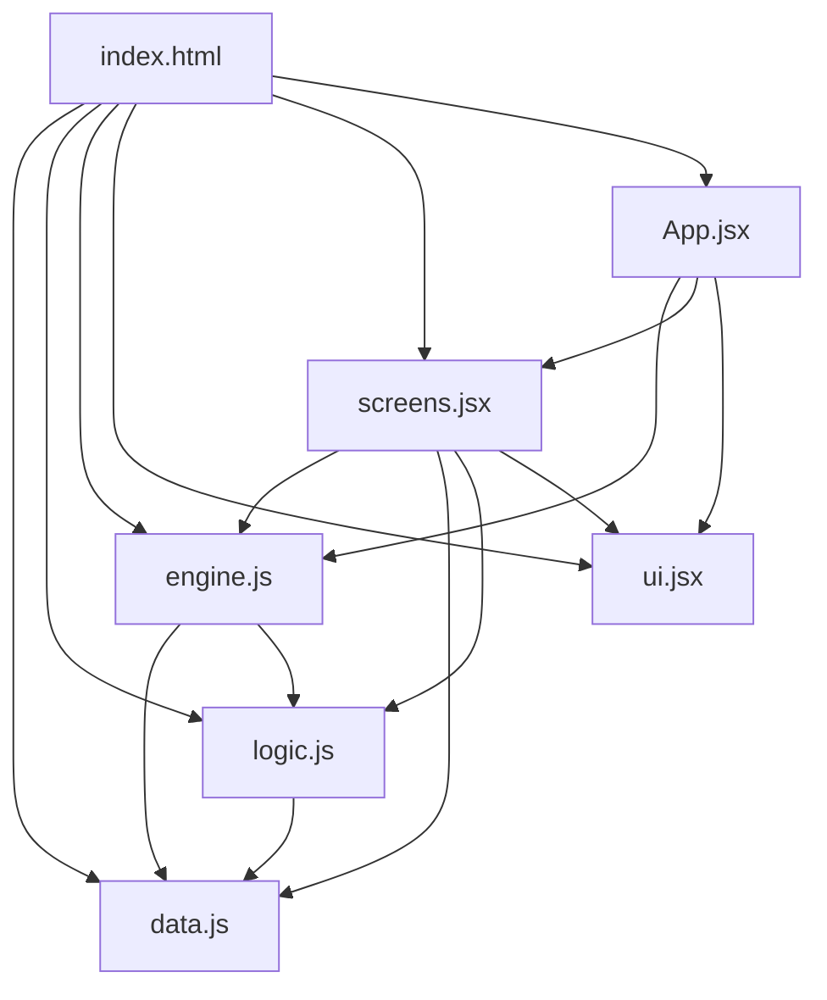

# 🏴☠️ **Caribbean Pirates Game - Architecture Documentation**

---

---

## **📌 Table of Contents**

1. [Overview](#overview)
2. [Architecture Diagram](#architecture-diagram)
3. [File Structure](#file-structure)
4. [Core Components](#core-components)
  - [data.js](#1-datajs)
  - [logic.js](#2-logicjs)
  - [engine.js](#3-enginejs)
  - [ui.jsx](#4-uijx)
  - [screens.jsx](#5-screensjsx)
  - [App.jsx](#6-appjsx)
  - [index.html](#7-indexhtml)
5. [Data Flow](#data-flow)
6. [State Management](#state-management)
7. [Game Mechanics](#game-mechanics)
  - [Combat System](#combat-system)
  - [Mission System](#mission-system)
  - [Event System](#event-system)
  - [Reputation System](#reputation-system)
  - [Crew and Morale](#crew-and-morale)
8. [Extensibility](#extensibility)
9. [Future Improvements](#future-improvements)

---

---

## **🎯 Overview**

**Caribbean Pirates** is a turn-based strategy game inspired by *Sid Meier’s Pirates!*. The architecture follows a **modular, stateless design** with clear separation of concerns:

- **Data**: Centralized constants (ports, ships, factions, etc.).
- **Logic**: Pure functions for game mechanics (combat, travel, etc.).
- **State**: Managed via `useReducer` in `engine.js`.
- **UI**: Reusable, game-agnostic components in `ui.jsx`.
- **Screens**: Game-specific components in `screens.jsx`.

**Tech Stack**:

- **Frontend**: React 18 (with `useReducer` for state).
- **Styling**: Inline CSS (no external libraries).
- **Build**: Babel (for JSX transpilation in-browser).
- **Storage**: `localStorage` for save/load.

---

---

## **🏗️ Architecture Diagram**



**Dependencies Flow**:

1. `index.html` loads all scripts in order.
2. `App.jsx` initializes state and renders screens.
3. Screens dispatch actions to `engine.js`.
4. `engine.js` uses `logic.js` for pure calculations.
5. All files reference `data.js` for constants.

---

---

## **📁 File Structure**

```
📁 project/
├── index.html          # Entry point: loads React, Babel, and scripts.
├── data.js             # Game constants: SHIPS, PORTS, FACTIONS, MISSION_POOL, etc.
├── logic.js            # Pure functions: combat, missions, events, sailing, etc.
├── engine.js           # State management: initialState, reducer, action constants.
├── ui.jsx              # UI primitives: Btn, Bar, Pill, etc. + theme tokens (T).
├── screens.jsx         # All screen components: Port, Map, Sailing, etc.
└── App.jsx             # Root component: useReducer, screen router, HUD.
```

---

---

## **🧩 Core Components**

---

### **1. `data.js**`

**Purpose**: Centralized **game constants** (no logic).  
**Exports**: `window.D` (global access).

#### **Key Data**:


| **Constant**        | **Purpose**                                              | **Example**                                                                                   |
| ------------------- | -------------------------------------------------------- | --------------------------------------------------------------------------------------------- |
| `PORTS`             | Port definitions (name, coordinates, faction, services). | `{ port_royal: { name: "Port Royal", x: 650, y: 300, faction: "english", ... } }`             |
| `SHIPS`             | Ship types (stats, cost, upgradeable).                   | `{ sloop: { maxHull: 100, maxCrew: 50, cannons: 10, speed: 8, ... } }`                        |
| `FACTIONS`          | Faction definitions (label, color, rivals).              | `{ english: { label: "English", color: "#ff0000", rivalFactions: ["spanish"] } }`             |
| `UPGRADES`          | Ship upgrades (name, cost, effects).                     | `{ reinforced_hull: { name: "Reinforced Hull", cost: 500, effects: { hullBonus: 0.2 } } }`    |
| `MISSION_POOL`      | Mission templates (type, target, rewards, enemies).      | `{ id: "hunt_pirate", type: "combat", enemy: { hull: 150, cannons: 15, ... } }`               |
| `RANDOM_EVENTS`     | Random events (type, triggers, choices).                 | `{ id: "storm", type: "hazard", choices: [{ label: "Brace", outcome: { hullDamage: 15 } }] }` |
| `STARTS`            | Starting scenarios (bonuses).                            | `{ id: "merchant", bonuses: ["+2000 gold", "ship: merchantman"] }`                            |
| `FACTION_RELATIONS` | Predefined faction relationships.                        | `{ english: { spanish: -1, french: -1, pirate: -1 } }`                                        |


**Design Principle**:

- **No logic**: Pure data. All game rules are defined here.
- **Global access**: Exposed via `window.D` for easy debugging.

---

### **2. `logic.js**`

**Purpose**: **Pure functions** for game mechanics (no side effects).  
**Exports**: `window.L` (global access).

#### **Key Functions**:


| **Function**          | **Purpose**                                                                 | **Example**                                                                                               |
| --------------------- | --------------------------------------------------------------------------- | --------------------------------------------------------------------------------------------------------- |
| `resolveCombatAction` | Calculates damage/outcomes for combat actions (broadside, precision, etc.). | `L.resolveCombatAction(state, "broadside")` → `{ player: { hullDamage: 20 }, enemy: { hullDamage: 15 } }` |
| `calculateTravelDays` | Computes days to sail between ports (distance, wind, morale).               | `L.calculateTravelDays("port_royal", "tortuga", state)` → `3`                                             |
| `generateMissions`    | Randomly selects missions for a port.                                       | `L.generateMissions("port_royal", state)` → `[mission1, mission2]`                                        |
| `triggerRandomEvent`  | Picks a random event based on conditions.                                   | `L.triggerRandomEvent(state)` → `{ id: "storm", type: "hazard", ... }`                                    |
| `payCrewWages`        | Calculates daily crew wages (scales with morale).                           | `L.payCrewWages(state)` → `60` (for 30 crew)                                                              |
| `getShipStats`        | Returns ship stats **with upgrades applied**.                               | `L.getShipStats(state)` → `{ maxHull: 144, cannons: 12, ... }` (with +20% hull)                           |
| `hasUpgrade`          | Checks if a ship has an upgrade.                                            | `L.hasUpgrade(state, "reinforced_hull")` → `true`/`false`                                                 |


**Design Principle**:

- **Pure functions**: No state mutation. Always return new data.
- **Reusable**: Used by `engine.js` and screens.

---

### **3. `engine.js**`

**Purpose**: **State management** (initial state, reducer, action constants).  
**Exports**: `window.E` (global access).

#### **Key Components**:


| **Component**          | **Purpose**                                                             | **Example**                                                                |
| ---------------------- | ----------------------------------------------------------------------- | -------------------------------------------------------------------------- |
| `A` (Action Constants) | Named constants for all actions (e.g., `A.SAIL_TO`, `A.BATTLE_ACTION`). | `A: { SAIL_TO: "SAIL_TO", BATTLE_ACTION: "BATTLE_ACTION", ... }`           |
| `initialState`         | Default game state (ship, crew, gold, etc.).                            | `{ screen: "start", gold: 1000, ship: { type: "sloop", hull: 100 }, ... }` |
| `reducer`              | Handles state changes based on actions.                                 | `(state, action) => newState`                                              |


#### **Reducer Logic**:

- **Navigation**: `A.NAVIGATE`, `A.SAIL_TO`, `A.ENTER_PORT`.
- **Game**: `A.START_GAME`, `A.SAVE_GAME`, `A.LOAD_GAME`.
- **Port**: `A.REPAIR`, `A.BUY_SHIP`, `A.BUY_UPGRADE`, `A.HIRE_CREW`.
- **Missions**: `A.TAKE_MISSION`, `A.COMPLETE_MISSION`, `A.ABANDON_MISSION`.
- **Combat**: `A.BATTLE_ACTION`, `A.DISMISS_BATTLE`.
- **Events**: `A.RESOLVE_EVENT`.
- **Daily**: `A.ADVANCE_DAY` (handles wages, reputation decay, morale, etc.).

**Design Principle**:

- **Centralized state**: All state changes flow through the reducer.
- **Action-driven**: State is immutable; actions describe changes.

---

### **4. `ui.jsx**`

**Purpose**: **Reusable UI components** and theme tokens.  
**Exports**: `window.UI` (global access).

#### **Theme Tokens (`T`)**:

```js
{
  bg: "#0a141e",        // Background
  gold: "#ffd700",      // Accent color
  text: "#e0e0e0",      // Primary text
  panel: "#121c28",     // Panel background
  border: "#2a3a4a",    // Default border
  // ... (colors for factions, risks, etc.)
}
```

#### **UI Components**:


| **Component**  | **Purpose**                                                    | **Example Usage**                                                   |
| -------------- | -------------------------------------------------------------- | ------------------------------------------------------------------- |
| `Btn`          | Styled button (variants: `default`, `gold`, `ghost`, `green`). | `<Btn v="gold" onClick={handleClick}>Click Me</Btn>`                |
| `Bar`          | Progress bar (e.g., hull, morale).                             | `<Bar value={80} max={100} color={T.greenBr} />`                    |
| `Pill`         | Label/tag (e.g., faction, reputation).                         | `<Pill label="Allied" color={T.greenBr} />`                         |
| `StatBlock`    | Label + value (e.g., "Hull: 100/120").                         | `<StatBlock label="Gold" value="1000g" />`                          |
| `SectionTitle` | Title with optional action button.                             | `<SectionTitle action={<Btn>Refresh</Btn>}>Missions</SectionTitle>` |
| `ScreenHeader` | Header with back button.                                       | `<ScreenHeader title="Shipyard" onBack={() => navigate("port")} />` |
| `LogList`      | Scrollable list of log entries.                                | `<LogList entries={state.log} />`                                   |
| `Divider`      | Horizontal rule.                                               | `<Divider />`                                                       |
| `EmptyState`   | Placeholder for empty content.                                 | `<EmptyState message="No missions available." />`                   |


**Design Principle**:

- **Game-agnostic**: Components know nothing about game rules.
- **Theme-driven**: Uses `T` tokens for consistent styling.

---

### **5. `screens.jsx**`

**Purpose**: **Game-specific screens** (Port, Map, Sailing, etc.).  
**Exports**: `window.S` (global access).

#### **Screens**:


| **Screen**       | **Purpose**                                    | **Key Features**                                                |
| ---------------- | ---------------------------------------------- | --------------------------------------------------------------- |
| `StartScreen`    | Game start menu (scenario selection).          | Displays starting scenarios (merchant, privateer, etc.).        |
| `PortScreen`     | Main hub (shipyard, missions, crew, factions). | Shows port info, ship status, missions, and services.           |
| `MapScreen`      | Interactive map for sailing between ports.     | Displays ports, connections, wind, and allows clicking to sail. |
| `SailingScreen`  | Turn-based sailing (advance days, enter port). | Shows progress, wind, and controls for advancing time.          |
| `ShipyardScreen` | Buy ships/upgrades and repair.                 | Lists available ships/upgrades with costs.                      |
| `CrewScreen`     | Hire crew and manage morale.                   | Shows crew stats, hiring options, and morale.                   |
| `FactionsScreen` | View reputation with all factions.             | Displays reputation bars for each faction/port.                 |
| `EventScreen`    | Random event resolution.                       | Shows event choices and applies outcomes.                       |
| `BattleScreen`   | Combat resolution.                             | Handles player/NPC turns, actions, and victory/defeat.          |


**Design Principle**:

- **Dumb components**: Screens only render data and dispatch actions.
- **No logic**: Business logic lives in `logic.js` or `engine.js`.

---

### **6. `App.jsx**`

**Purpose**: **Root component** (initializes state, renders screens, HUD).  
**Key Features**:

- Uses `useReducer` with `engine.js`’s `reducer` and `initialState`.
- **Screen router**: Renders the current screen based on `state.screen`.
- **HUD**: Displays gold, day, crew, hull, and current port.
- **Layout**: Ensures HUD doesn’t overlap with screens (via `paddingTop`).

**Design Principle**:

- **Single source of truth**: State is managed in `engine.js`.
- **Separation of concerns**: App handles routing; screens handle rendering.

---

### **7. `index.html**`

**Purpose**: **Entry point** (loads React, Babel, and scripts).  
**Key Features**:

- Loads React and Babel from CDNs.
- Loads scripts in **dependency order**:
  ```html
  <script type="text/babel" src="data.js"></script>
  <script type="text/babel" src="logic.js"></script>
  <script type="text/babel" src="engine.js"></script>
  <script type="text/babel" src="ui.jsx"></script>
  <script type="text/babel" src="screens.jsx"></script>
  <script type="text/babel" src="App.jsx"></script>
  ```
- Mounts the app to `#root`.

**Design Principle**:

- **Order matters**: Dependencies must load before dependents.

---

---

---

## **🔄 Data Flow**

1. **User Interaction**:
  - Clicks a button in a screen (e.g., "Sail to Tortuga").
2. **Action Dispatch**:
  - Screen dispatches an action: `dispatch({ type: A.SAIL_TO, port: "tortuga" })`.
3. **Reducer**:
  - `engine.js`’s `reducer` processes the action and updates state (e.g., sets `destination`, `sailingDaysLeft`).
4. **Pure Functions**:
  - Reducer uses `logic.js` functions (e.g., `L.calculateTravelDays()`) for calculations.
5. **Re-render**:
  - React re-renders the current screen with the new state.
6. **Repeat**.

**Example Flow (Sailing)**:

```
User clicks "Sail to Tortuga"
→ PortScreen dispatches { type: A.SAIL_TO, port: "tortuga" }
→ reducer calls L.calculateTravelDays()
→ State updates: { destination: "tortuga", sailingDaysLeft: 4, screen: "sailing" }
→ SailingScreen renders with progress bar
→ User clicks "Advance Day"
→ reducer deducts wages, decays reputation, checks for events
→ State updates: { day: 2, gold: 940, sailingDaysLeft: 3 }
→ SailingScreen re-renders
```

---

---

## **🧠 State Management**

### **State Shape**

```js
{
  // Meta
  screen: "port",          // Current screen
  day: 1,                  // Current day
  log: ["Set sail..."],    // Game log

  // Player
  gold: 1000,              // Gold
  fame: 0,                 // Fame points
  currentPort: "port_royal", // Current port
  destination: "tortuga",  // Target port (if sailing)
  sailingDaysLeft: 2,      // Days remaining to destination
  sailingDaysTotal: 4,     // Total days for voyage
  wind: { angle: 45, speed: 10 }, // Wind direction/speed

  // Ship
  ship: {
    type: "sloop",           // Ship type (key in SHIPS)
    name: "Sea Dog",         // Ship name
    hull: 100,              // Current hull HP
    cannons: 10,             // Base cannons (upgrades add more)
    upgrades: ["reinforced_hull"] // Installed upgrades
  },

  // Crew
  crew: {
    current: 30,            // Current crew
    max: 50,                 // Max crew (from SHIPS[ship.type].maxCrew)
    morale: 80               // Morale % (0-100)
  },

  // Missions
  missions: [...],          // Available missions at current port
  activeMission: null,      // Active mission (or null)

  // Reputation
  reputation: {             // Reputation per port (0-100)
    port_royal: 50,
    tortuga: 30,
    ...
  },

  // Combat
  battleState: null,        // Active battle (or null)
  // battleState: {
  //   phase: "player_turn",  // "player_turn", "npc_turn", "victory", "defeat", "fled"
  //   playerHull: 80,
  //   enemyHull: 60,
  //   enemy: { name: "Pirate", hull: 100, cannons: 10, crew: 40, faction: "pirate" },
  //   round: 1,
  //   log: ["Player: Broadside..."],
  //   returnScreen: "sailing" // Screen to return to after battle
  // },

  // Events
  activeEvent: null         // Active event (or null)
}
```

### **Action Constants (`A`)**

All actions are defined in `engine.js`:

```js
A: {
  // Navigation
  NAVIGATE: "NAVIGATE",
  SAIL_TO: "SAIL_TO",
  ADVANCE_DAY: "ADVANCE_DAY",
  ENTER_PORT: "ENTER_PORT",

  // Game
  START_GAME: "START_GAME",
  SAVE_GAME: "SAVE_GAME",
  LOAD_GAME: "LOAD_GAME",

  // Port
  REPAIR: "REPAIR",
  BUY_SHIP: "BUY_SHIP",
  BUY_UPGRADE: "BUY_UPGRADE",
  HIRE_CREW: "HIRE_CREW",
  REFRESH_MISSIONS: "REFRESH_MISSIONS",
  TAKE_MISSION: "TAKE_MISSION",
  COMPLETE_MISSION: "COMPLETE_MISSION",
  ABANDON_MISSION: "ABANDON_MISSION",

  // Combat
  BATTLE_ACTION: "BATTLE_ACTION",
  DISMISS_BATTLE: "DISMISS_BATTLE",

  // Events
  RESOLVE_EVENT: "RESOLVE_EVENT",
  SET_WIND: "SET_WIND" // For debugging
}
```

---

---

## **⚔️ Game Mechanics**

---

### **Combat System**

#### **Turn Structure**

1. **Player turn**: Choose an action (`broadside`, `precision`, `grapple`, `evade`).
2. **NPC turn**: NPC automatically picks an action (weighted random).
3. **Damage Calculation**:
  - **Broadside**: 100% accuracy, 60% hull / 40% crew damage.
  - **Precision**: 70% accuracy, 90% hull / 10% crew damage.
  - **Grapple**: 80% success, 100% crew damage (no hull).
  - **Evade**: 90% success, flee if successful.

#### **Modifiers**

- **Morale**:
  - `< 30%`: Combat damage ×1.2 (disorganized crew).
  - `> 70%`: Combat damage ×0.9 (motivated crew).
- **Upgrades**: Applied via `L.getShipStats(state)` (e.g., `reinforced_hull` → +20% max hull).

#### **Code Flow**

```js
// Player clicks "Broadside" in BattleScreen
dispatch({ type: A.BATTLE_ACTION, action: "broadside" });

// reducer calls L.resolveCombatAction(state, "broadside")
// → Returns { player: { hullDamage: X, crewLoss: Y }, enemy: { ... } }

// State updates:
// - battleState.playerHull -= enemyDamage
// - battleState.enemyHull -= playerDamage
// - Check for victory/defeat/flee
```

---

### **Mission System**

#### **Mission Types**


| **Type**  | **Behavior**                                                               | **Example**                         |
| --------- | -------------------------------------------------------------------------- | ----------------------------------- |
| `trade`   | Sail to `targetPort` and complete.                                         | "Deliver Spices to Havana"          |
| `escort`  | Sail to `targetPort` and complete.                                         | "Escort Merchant to Curaçao"        |
| `combat`  | **Immediate combat** on acceptance.                                        | "Hunt the Pirate Scourge"           |
| `smuggle` | Sail to `targetPort`; **random combat** during voyage (`interceptChance`). | "Smuggle Contraband to Tortuga"     |
| `assault` | Sail to `targetPort`; **combat on arrival**.                               | "Assault Spanish Outpost at Havana" |


#### **Mission Lifecycle**

1. **Generation**:
  - Ports generate 2-3 random missions from `MISSION_POOL` (filtered by faction/rep).
2. **Acceptance**:
  - `A.TAKE_MISSION` sets `activeMission`.
  - For `type: "combat"`, **immediate battle** starts.
3. **Progress**:
  - For `type: "smuggle"`, random combat may trigger during `A.ADVANCE_DAY`.
  - For `type: "assault"`, combat triggers on `A.ENTER_PORT`.
4. **Completion**:
  - For `type: "trade"/"escort"`, complete on arrival at `targetPort`.
  - For `type: "combat"/"assault"`, complete on **victory** (via `A.DISMISS_BATTLE`).
  - Rewards: gold, fame, reputation.

#### **Mission Data Structure**

```js
{
  id: "hunt_pirate",
  name: "Hunt the Pirate Scourge",
  desc: "Sink the notorious pirate 'Black Bart' and his crew.",
  targetPort: null,       // null for instant combat
  type: "combat",         // "trade", "escort", "combat", "smuggle", "assault"
  gold: 2000,
  fame: 50,
  risk: "high",
  faction: "english",     // Faction offering the mission
  repImpact: { english: +30, pirate: -20 }, // Reputation changes
  enemy: {                // For combat/assault/smuggle missions
    name: "Black Bart's Revenge",
    hull: 150,
    cannons: 15,
    crew: 40,
    faction: "pirate"
  },
  interceptChance: 0.7    // For smuggle missions (0-1)
}
```

---

### **Event System**

#### **Event Types**


| **Type**  | **Behavior**                            | **Example**            |
| --------- | --------------------------------------- | ---------------------- |
| `hazard`  | Automatic outcome (e.g., storm damage). | "Violent Storm!"       |
| `choice`  | Player chooses an outcome.              | "Merchant in Distress" |
| `reward`  | Automatic reward (e.g., treasure).      | "Treasure Map Found!"  |
| `crew`    | Affects crew (e.g., mutiny, deserters). | "Mutiny!"              |
| `faction` | Affects reputation (e.g., navy patrol). | "Navy Patrol!"         |


#### **Triggering Events**

- **At sea**: 10% chance per `A.ADVANCE_DAY`.
- **In port**: 5% chance per day (e.g., when refreshing missions).
- **Conditions**: Some events only trigger if conditions are met (e.g., `mutiny` requires morale < 20%).

#### **Event Data Structure**

```js
{
  id: "storm",
  type: "hazard",
  title: "Violent Storm!",
  desc: "A storm batters your ship for days.",
  condition: (state) => state.sailingDaysLeft > 0, // Optional: only at sea
  choices: [
    {
      label: "Brace for impact",
      outcome: {
        log: "The storm rages on! Your ship takes damage.",
        hullDamage: 15,
        daysLost: 2,
        crewLoss: 2
      }
    }
  ]
}
```

---

### **Reputation System**

#### **Rules**

- **Decay**: -1 reputation/port **per day** (capped at 0).
- **Missions**: Completing missions for a faction → `+reputation` for that faction’s ports, `-reputation` for rivals.
- **Combat**: Attacking a ship → `-reputation` for that faction’s ports.
- **Thresholds**:
  - `< 10`: Hostile (random attacks on entry).
  - `< 30`: Cannot use shipyard/crew services.
  - `>= 80`: Allied (bonuses possible).

#### **Faction Relations**

```js
FACTION_RELATIONS: {
  english: { spanish: -1, french: -1, dutch: 0, pirate: -1 },
  spanish: { english: -1, french: -1, dutch: -1, pirate: -1 },
  // ...
}
```

---

### **Crew and Morale**

#### **Crew Mechanics**

- **Hiring**: Costs `50g/sailor` (capped by ship’s `maxCrew`).
- **Wages**: `crew.current * 2 * (morale < 30 ? 1.5 : 1)` gold **per day**.
- **Losses**:
  - **Broadside**: `Math.floor(enemyCannons * 0.1)` crew lost.
  - **Precision**: `Math.floor(enemyCannons * 0.05)` crew lost.
  - **Grapple**: `Math.floor(playerCrew * 0.05)` if failed.
  - **Evade (fail)**: `Math.floor(playerCrew * 0.03)` crew lost.

#### **Morale Mechanics**

- **Base**: Starts at 80%.
- **Decay**: -1%/day if `< 30%` (spiral of despair).
- **Combat**:
  - **Win**: +5% morale.
  - **Lose**: -15% morale.
  - **Broadside/Precision**: -5%/-10% morale.
- **Effects**:
  - `< 30%`: Wages ×1.5, combat damage ×1.2.
  - `> 70%`: Combat damage ×0.9.

---

---

## **🚀 Extensibility**

The architecture is designed to be **easily extended**. Here’s how to add new features:

---

### **1. Add a New Ship Type**

1. `**data.js**`: Add to `SHIPS`:
  ```js
   my_ship: {
     name: "My Ship",
     maxHull: 200,
     maxCrew: 100,
     cannons: 20,
     speed: 5,
     cost: 5000,
     upgradeable: ["reinforced_hull"],
     desc: "A custom ship."
   }
  ```
2. **Done!** The game will automatically support it in shipyards.

---

### **2. Add a New Mission Type**

1. `**data.js**`: Add to `MISSION_POOL`:
  ```js
   {
     id: "my_mission",
     name: "My Mission",
     desc: "A custom mission.",
     targetPort: "tortuga",
     type: "custom",  // New type
     gold: 1000,
     faction: "pirate",
     repImpact: { pirate: +10 }
   }
  ```
2. `**engine.js**`: Add handling for `type: "custom"` in the reducer (e.g., in `A.TAKE_MISSION` or `A.ENTER_PORT`).

---

### **3. Add a New Event**

1. `**data.js**`: Add to `RANDOM_EVENTS`:
  ```js
   {
     id: "my_event",
     type: "choice",
     title: "My Event",
     desc: "Something happens!",
     choices: [
       {
         label: "Option 1",
         outcome: { gold: 100, log: "You gain gold!" }
       }
     ]
   }
  ```
2. **Done!** The event will appear randomly.

---

### **4. Add a New Upgrade**

1. `**data.js**`: Add to `UPGRADES`:
  ```js
   my_upgrade: {
     name: "My Upgrade",
     desc: "Does something cool.",
     cost: 1000,
     effects: { speedBonus: 2 } // Custom effect
   }
  ```
2. `**logic.js**`: Update `getShipStats` to apply the effect:
  ```js
   if (upgrade.effects.speedBonus) {
     stats.speed += upgrade.effects.speedBonus;
   }
  ```
3. **Done!** The upgrade will appear in shipyards.

---

### **5. Add a New Combat Action**

1. `**screens.jsx**`: Add the action to `BattleScreen`:
  ```jsx
   { a: "my_action", label: "💥 My Action", desc: "Does something special." }
  ```
2. `**logic.js**`: Handle the action in `resolveCombatAction`:
  ```js
   case "my_action":
     // Custom logic
     break;
  ```
3. **Done!** The action will appear in combat.

---

---

## **🔮 Future Improvements**


| **Feature**               | **Implementation Notes**                                                         |
| ------------------------- | -------------------------------------------------------------------------------- |
| **Procedural Generation** | Replace hardcoded `PORTS`/`SHIPS` with algorithms (e.g., Perlin noise for maps). |
| **Save/Load System**      | Extend to cloud storage or indexedDB for larger saves.                           |
| **Difficulty Levels**     | Scale enemy stats, mission rewards, or event frequency based on difficulty.      |
| **Ship Customization**    | Allow players to name their ships or design custom hulls.                        |
| **Fleet System**          | Add support for multiple ships (escort missions, fleet combat).                  |
| **Dynamic Economy**       | Prices for ships/upgrades/crew vary by port or global events.                    |
| **Diplomacy System**      | Negotiate with factions, sign treaties, or declare wars.                         |
| **Crafting System**       | Combine resources to craft upgrades or special items.                            |
| **Multiplayer**           | Use WebSockets or Firebase for real-time or turn-based multiplayer.              |
| **Mobile Support**        | Responsive design + touch controls for mobile devices.                           |


---

---

## **📚 Summary**


| **File**      | **Role**         | **Key Features**                                             |
| ------------- | ---------------- | ------------------------------------------------------------ |
| `data.js`     | Game constants   | PORTS, SHIPS, FACTIONS, MISSION_POOL, UPGRADES, etc.         |
| `logic.js`    | Pure functions   | Combat, travel, missions, events, crew, etc.                 |
| `engine.js`   | State management | initialState, reducer, action constants.                     |
| `ui.jsx`      | UI primitives    | Btn, Bar, Pill, StatBlock, etc. + theme tokens.              |
| `screens.jsx` | Game screens     | Port, Map, Sailing, Shipyard, Crew, Factions, Event, Battle. |
| `App.jsx`     | Root component   | useReducer, screen router, HUD.                              |
| `index.html`  | Entry point      | Loads React, Babel, and scripts in order.                    |


**Core Principles**:

1. **Separation of Concerns**: Data, logic, state, and UI are modular.
2. **Pure Functions**: Logic is stateless and reusable.
3. **Action-Driven**: State changes are explicit and predictable.
4. **Extensible**: Easy to add new ships, missions, events, etc.

---

**🎮 Ready to Expand?**  
This architecture supports **scaling the game** with new features while keeping the codebase clean and maintainable. Whether you want to add procedural generation, multiplayer, or a dynamic economy, the foundation is solid!