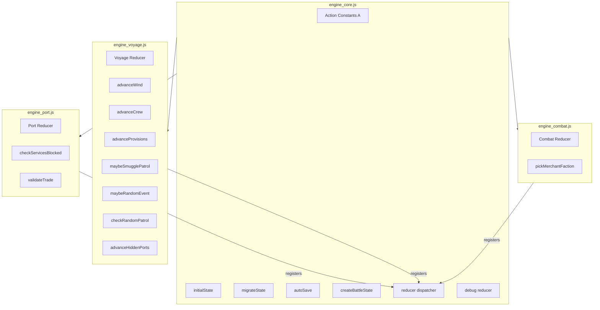

# specs_engine.md — Engine Architecture Specification

**Broadside Game Engine**  
*Last Updated: May 28, 2026*  
*Refactored: 4-Way Split (Core + Port + Voyage + Combat)*

---

## 📌 **Overview**

This document specifies the **architecture, responsibilities, and interactions** of the refactored `engine/` module, which has been split into **4 files** for improved maintainability:

```
engine_core.js   # Shared infrastructure (constants, initial state, reducer dispatcher)
engine_port.js    # Port domain (market, missions, crew, shipyard, repair)
engine_voyage.js  # Voyage domain (sailing, wind, provisions, hidden ports)
engine_combat.js   # Combat domain (encounters, battles, plunder, events)
```

**Core Principles:**

- **Single Responsibility**: Each file handles a distinct domain.
- **Shared Infrastructure**: `engine_core.js` contains global constants and the reducer dispatcher.
- **No Circular Dependencies**: `engine_core.js` loads first; domain files register their reducers afterward.
- **Global Namespace**: All files attach to `window.E` for cross-file access.

---

## 🏗️ **Architecture Diagram**



---

## 📁 **File Structure & Responsibilities**

---

### **1. `engine_core.js**` *(~250 lines)*

**Purpose**: Shared infrastructure, global constants, and reducer dispatcher.

#### **Contents**


| Category               | Items                                           | Description                                                  |
| ---------------------- | ----------------------------------------------- | ------------------------------------------------------------ |
| **Action Constants**   | `A.*` (44 total)                                | All action type strings (e.g., `NAVIGATE`, `BATTLE_ACTION`). |
| **Initial State**      | `initialState`                                  | Default game state (ship, crew, hold, reputation, etc.).     |
| **Shared Helpers**     | `autoSave`, `migrateState`, `createBattleState` | Utilities used across domains.                               |
| **Reducer Dispatcher** | `window.E._reducers`, `window.E.reducer`        | Chains all domain reducers.                                  |
| **Debug Reducer**      | 10 debug cases                                  | Development-only actions (e.g., `DEBUG_ADD_GOLD`).           |


#### **Key Code**

```javascript
// Action constants (all 44)
window.E.A = {
  NAVIGATE: "NAVIGATE",
  SAIL_TO: "SAIL_TO",
  // ... all other actions
};

// Initial state
window.E.initialState = { version: 1, screen: "start", ... };

// Shared helpers
window.E.autoSave = (state) => { ... };
window.E.migrateState = (loaded) => { ... };
window.E.createBattleState = (state, enemy, ...) => { ... };

// Reducer dispatcher
window.E._reducers = [];
window.E.reducer = (state, action) => {
  return window.E._reducers.reduce((s, r) => r(s, action), state);
};

// Debug reducer (registered first)
window.E._reducers.push((state, action) => {
  switch (action.type) {
    case window.E.A.DEBUG_ADD_GOLD: { ... }
    // ... all debug cases
  }
});
```

#### **Dependencies**

- `window.D` (data constants)
- `window.L` (logic helpers)
- `window.G` (generators)

#### **Exports**

- `window.E.A` (action constants)
- `window.E.initialState`
- `window.E.reducer` (main reducer)
- `window.E.autoSave`
- `window.E.migrateState`
- `window.E.createBattleState`
- `window.E._reducers` (reducer registry)

---

### **2. `engine_port.js**` *(~450 lines)*

**Purpose**: Port-related logic (market, missions, crew, shipyard, repairs, start/load).

#### **Contents**


| Category          | Items    | Description                             |
| ----------------- | -------- | --------------------------------------- |
| **Reducer Cases** | 23 cases | Port actions and state transitions.     |
| **Helpers**       | 2        | `checkServicesBlocked`, `validateTrade` |


#### **Reducer Cases**


| Case               | Description                                                        |
| ------------------ | ------------------------------------------------------------------ |
| `START_GAME`       | Initializes game state from a scenario.                            |
| `SAVE_GAME`        | Saves current state to `localStorage`.                             |
| `LOAD_GAME`        | Loads state from `localStorage` and regenerates market/missions.   |
| `NAVIGATE`         | Changes the current screen.                                        |
| `SAIL_TO`          | Sets destination and starts sailing.                               |
| `ENTER_PORT`       | Handles port entry (normal, hostile, or assault mission).          |
| `REPAIR`           | Repairs ship hull (cost based on reputation).                      |
| `BUY_SHIP`         | Purchases a new ship (truncates crew if needed).                   |
| `BUY_UPGRADE`      | Installs a ship upgrade.                                           |
| `HIRE_CREW`        | Adds crew members to the roster.                                   |
| `RAISE_MORALE`     | Spends gold to increase crew morale.                               |
| `REFRESH_MISSIONS` | Regenerates available missions in the current port.                |
| `TAKE_MISSION`     | Accepts a mission (combat missions trigger intercept immediately). |
| `COMPLETE_MISSION` | Completes a mission, awards gold/fame/rep, removes required goods. |
| `ABANDON_MISSION`  | Abandons a mission (reputation penalty).                           |
| `CONFIRM_TRADE`    | Executes a market trade (buys/sells goods).                        |
| `ENTER_MARKET`     | Switches to the market screen.                                     |
| `LEAVE_MARKET`     | Returns to the port screen.                                        |


#### **Helpers**


| Helper                 | Description                                                | Used By            |
| ---------------------- | ---------------------------------------------------------- | ------------------ |
| `checkServicesBlocked` | Checks if port services are blocked due to low reputation. | Port reducer cases |
| `validateTrade`        | Validates a trade action (gold, hold space).               | `CONFIRM_TRADE`    |


#### **Key Code**

```javascript
// Helpers
const checkServicesBlocked = (state) => { ... };
const validateTrade = (state, buys, sells) => { ... };

// Register port reducer
window.E._reducers.push((state, action) => {
  switch (action.type) {
    case A.START_GAME: { ... }
    case A.REPAIR: { ... }
    // ... all port cases
    default: return state;
  }
});

// Expose helpers globally
window.E.checkServicesBlocked = checkServicesBlocked;
window.E.validateTrade = validateTrade;
```

#### **Dependencies**

- `window.E.A` (from `engine_core.js`)
- `window.D` (PORTS, SHIPS, FACTIONS, UPGRADES, STARTS)
- `window.L` (logic helpers)
- `window.G` (generators)

---

### **3. `engine_voyage.js**` *(~250 lines)*

**Purpose**: Sailing and navigation logic (wind, provisions, day advancement, hidden ports).

#### **Contents**


| Category          | Items   | Description                      |
| ----------------- | ------- | -------------------------------- |
| **Reducer Cases** | 4 cases | Sailing and day-related actions. |
| **Helpers**       | 8       | Voyage-specific utilities.       |


#### **Reducer Cases**


| Case            | Description                                                                                                                |
| --------------- | -------------------------------------------------------------------------------------------------------------------------- |
| `ADVANCE_DAY`   | Progresses one day of sailing: updates wind, crew, provisions, checks for events/patrols/missions, discovers hidden ports. |
| `DISCOVER_PORT` | Manually discovers a hidden port.                                                                                          |
| `SAIL_TO`       | *Moved to `engine_port.js`* (see note below).                                                                              |
| `SET_WIND`      | *Moved to `engine_port.js`* (see note below).                                                                              |


**Note**: In the current implementation, `SAIL_TO` and `SET_WIND` are in `engine_port.js`. This is a **design choice** — they could logically belong in either `port` or `voyage`. For consistency, they are currently in `port` because they are triggered from the port screen.

#### **Helpers**


| Helper                  | Description                                          | Used By       |
| ----------------------- | ---------------------------------------------------- | ------------- |
| `advanceWind`           | Randomly adjusts wind angle/speed.                   | `ADVANCE_DAY` |
| `advanceCrew`           | Increments crew days aboard, reduces morale if low.  | `ADVANCE_DAY` |
| `advanceProvisions`     | Consumes food/water based on crew count.             | `ADVANCE_DAY` |
| `maybeSmugglePatrol`    | Triggers a patrol intercept for smuggle missions.    | `ADVANCE_DAY` |
| `maybeMissionEncounter` | Triggers escort/patrol mission encounters.           | `ADVANCE_DAY` |
| `maybeRandomEvent`      | Triggers random events (storms, shipwrecks, etc.).   | `ADVANCE_DAY` |
| `checkRandomPatrol`     | Triggers navy patrol intercepts.                     | `ADVANCE_DAY` |
| `advanceHiddenPorts`    | Checks and unlocks hidden ports based on conditions. | `ADVANCE_DAY` |


#### **Key Code**

```javascript
// Helpers
const advanceWind = (wind) => { ... };
const advanceCrew = (crew) => { ... };
const maybeSmugglePatrol = (state, ...) => { ... };
// ... etc

// Register voyage reducer
window.E._reducers.push((state, action) => {
  switch (action.type) {
    case A.ADVANCE_DAY: { ... }
    case A.DISCOVER_PORT: { ... }
    default: return state;
  }
});
```

#### **Dependencies**

- `window.E.A` (from `engine_core.js`)
- `window.D` (PORTS, FACTIONS)
- `window.L` (logic helpers)
- `window.G` (generators)

---

### **4. `engine_combat.js**` *(~500 lines)*

**Purpose**: Encounters, battles, plunder, and event resolution.

#### **Contents**


| Category          | Items    | Description                   |
| ----------------- | -------- | ----------------------------- |
| **Reducer Cases** | 12 cases | Combat and encounter actions. |
| **Helpers**       | 1        | `pickMerchantFaction`         |


#### **Reducer Cases**


| Case                  | Description                                                                    |
| --------------------- | ------------------------------------------------------------------------------ |
| `INTERCEPT_FIGHT`     | Engages an enemy in combat.                                                    |
| `INTERCEPT_FLEE`      | Attempts to flee from an encounter (speed check).                              |
| `INTERCEPT_PARLEY`    | Attempts to negotiate with an enemy (reputation check).                        |
| `INTERCEPT_BRIBE`     | Pays to avoid an encounter (reputation penalty).                               |
| `INTERCEPT_SURRENDER` | Surrenders to an enemy (gold/crew/cargo penalties).                            |
| `BATTLE_ACTION`       | Resolves a player action in combat (broadside, precision, grapple, evade).     |
| `DISMISS_BATTLE`      | Ends combat: handles victory/defeat, plunder, or return to sailing/port.       |
| `TAKE_PLUNDER`        | Takes cargo from a defeated enemy (50% gold if taking cargo, 100% if sinking). |
| `RESOLVE_EVENT`       | Resolves a random event choice (applies outcomes like gold, damage, morale).   |
| `PATROL_INSPECT`      | Handles navy inspection of cargo (fines/seizures for contraband).              |
| `ATTACK_PIRATE`       | Initiates combat with a pirate (from event).                                   |
| `ATTACK_MERCHANT`     | Initiates combat with a merchant (from event).                                 |


#### **Helpers**


| Helper                | Description                            | Used By           |
| --------------------- | -------------------------------------- | ----------------- |
| `pickMerchantFaction` | Randomly selects a non-pirate faction. | `ATTACK_MERCHANT` |


#### **Key Code**

```javascript
// Helper
const pickMerchantFaction = () => { ... };

// Register combat reducer
window.E._reducers.push((state, action) => {
  switch (action.type) {
    case A.INTERCEPT_FIGHT: { ... }
    case A.BATTLE_ACTION: { ... }
    // ... all combat cases
    default: return state;
  }
});
```

#### **Dependencies**

- `window.E.A` (from `engine_core.js`)
- `window.D` (PORTS, FACTIONS, SURRENDER_CONSEQUENCE)
- `window.L` (logic helpers)
- `window.G` (generators)

---

## 🔗 **Load Order & Dependencies**

### **Load Order (Critical!)**

```html
<!-- Core MUST load first -->
<script src="engine_core.js"></script>
<!-- Domain files can load in any order after core -->
<script src="engine_port.js"></script>
<script src="engine_voyage.js"></script>
<script src="engine_combat.js"></script>
```

### **Why Order Matters**

1. `**engine_core.js**` must load first because:
  - It defines `window.E.A` (action constants) used by all domain files.
  - It initializes `window.E._reducers` (reducer registry).
  - It exposes `window.E.initialState` and other shared helpers.
2. **Domain files** can load in any order because:
  - They only **read** from `window.E` (constants, helpers).
  - They **register** their reducers by pushing to `window.E._reducers`.

---

## 🔄 **Reducer Chaining Mechanism**

### **How It Works**

1. **Core Initialization**:
  ```javascript
   // In engine_core.js
   window.E._reducers = [];  // Reducer registry
   window.E.reducer = (state, action) => {
     return window.E._reducers.reduce((s, r) => r(s, action), state);
   };
  ```
2. **Domain Registration**:
  ```javascript
   // In each domain file (engine_port.js, etc.)
   window.E._reducers.push((state, action) => {
     switch (action.type) {
       case A.SOMETHING: { ... }
       default: return state;
     }
   });
  ```
3. **Dispatch Flow**:
  - When `window.E.reducer(state, action)` is called:
  1. The **debug reducer** (registered first in `engine_core.js`) runs.
  2. Then **each domain reducer** runs in registration order.
  3. Each reducer either handles the action or returns `state` unchanged.

### **Example Flow**

```
Action: A.ADVANCE_DAY
├── Debug reducer: No match → returns state unchanged
├── Port reducer: No match → returns state unchanged
├── Voyage reducer: Matches A.ADVANCE_DAY → updates state
└── Combat reducer: No match → returns state unchanged

Result: Voyage reducer handles the action, state is updated.
```

---

## 📊 **File Statistics**


| File               | Lines     | Reducer Cases | Helpers | Purpose               |
| ------------------ | --------- | ------------- | ------- | --------------------- |
| `engine_core.js`   | ~250      | 10 (debug)    | 3       | Shared infrastructure |
| `engine_port.js`   | ~450      | 23            | 2       | Port logic            |
| `engine_voyage.js` | ~250      | 4             | 8       | Sailing logic         |
| `engine_combat.js` | ~500      | 12            | 1       | Combat logic          |
| **Total**          | **~1450** | **44**        | **14**  | All engine logic      |


**Note**: The total is slightly less than the original `engine.js` (~1500 lines) because:

- Removed duplicate `window.E` initialization.
- Removed redundant comments/boilerplate.

---

## 🎯 **Domain Responsibilities**

### `**engine_core.js**` *(Shared)*

- **Global constants**: All `A.*` action types.
- **Initial state**: Default game state.
- **Shared helpers**: `autoSave`, `migrateState`, `createBattleState`.
- **Reducer dispatcher**: Chains all domain reducers.
- **Debug actions**: Development