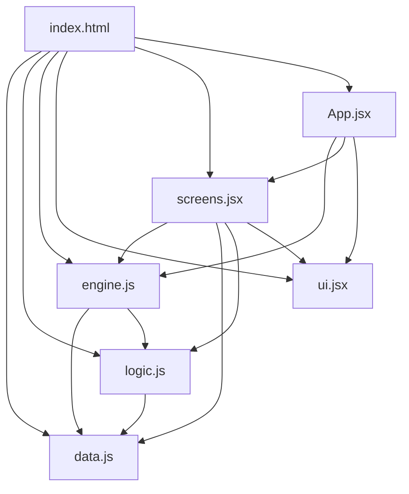

# 🏴☠️ **Caribbean Pirates Game - Architecture & Implementation Plan**

*Inspired by Sid Meier's Pirates! - Turn-Based Strategy*

---

---

## **📌 Table of Contents**

1. [Overview](#overview)
2. [Technical Explanations](#technical-explanations)
  - [Reducer (State Management)](#reducer-state-management)
  - [CSS: Inline vs. Tailwind](#css-inline-vs-tailwind)
3. [Game Mechanics Proposals](#game-mechanics-proposals)
  - [Combat System](#1-combat-system)
  - [Crew Mechanics](#2-crew-mechanics)
  - [Travel System](#3-travel-system)
  - [Reputation System](#4-reputation-system)
  - [Mission System](#5-mission-system)
  - [Random Events](#6-random-events)
4. [Architecture](#architecture)
  - [File Structure](#file-structure)
  - [Dependencies Flow](#dependencies-flow)
5. [File-by-File Plan](#file-by-file-plan)
  - `[data.js](#1-datajs)`
  - `[logic.js](#2-logicjs)`
  - `[engine.js](#3-enginejs)`
  - `[ui.jsx](#4-uijx)`
  - `[App.jsx](#5-appjsx)`
  - `[index.html](#6-indexhtml)`
6. [Modifications to Existing Files](#modifications-to-existing-files)
7. [Summary of Changes](#summary-of-changes)
8. [Next Steps](#next-steps)

---

---

## **🎯 Overview**

This document outlines the **architecture**, **game mechanics**, and **implementation plan** for a turn-based pirate adventure game.  
The goal is to create a modular, maintainable, and extensible codebase inspired by *Sid Meier's Pirates!*.

- **Core Loop**: Sail between ports, take missions, engage in combat, manage crew/reputation, upgrade ships.
- **Turn-Based**: 1 day = 1 turn for sailing; 1 action = 1 turn for combat.
- **Tech Stack**: React (with `useReducer`), plain JavaScript, inline CSS.

---

---

## **🔧 Technical Explanations**

---

### **Reducer (State Management)**

#### **What is a Reducer?**

In React, `useReducer` is a state management tool for **complex logic**. It consists of:

- **Reducer function**: `(state, action) => newState`
  - Takes the current `state` and an `action` (e.g., `{ type: "SAIL_TO", port: "tortuga" }`).
  - Returns a **new state** (never mutates the old state).
- **Initial state**: The starting values for the game (e.g., `gold: 1000`, `currentPort: "port_royal"`).
- **Dispatch function**: Used to send actions to the reducer.

#### **Why Use It for This Game?**

✅ **Centralized logic**: All state changes (sailing, combat, missions) are handled in **one place** (`engine.js`).  
✅ **Predictable**: Same action + state → same result (easy to debug).  
✅ **Scalable**: Easy to add new features (e.g., factions, upgrades).  
✅ **Time-travel friendly**: Can later add save/load or undo/redo by storing action history.

#### **How It Works in Your Game**

1. `**App.jsx**` initializes state with `useReducer(reducer, initialState)`.
2. **Screens** (e.g., `PortScreen`, `BattleScreen`) call `dispatch({ type: A.SAIL_TO, port: "tortuga" })`.
3. The **reducer** updates the state using **pure functions from `logic.js**` (e.g., `L.calculateTravelDays()`).

---

### **CSS: Inline vs. Tailwind**


| **Aspect**             | **Inline CSS**                                                                                     | **Tailwind (Utility Classes)**                |
| ---------------------- | -------------------------------------------------------------------------------------------------- | --------------------------------------------- |
| **Pros**               | No dependencies.                                                                                   | Faster to write (predefined classes).         |
| &nbsp;                 | Full control over styles.                                                                          | Consistent design (reusable classes).         |
| &nbsp;                 | Easier to scope (styles are local).                                                                | Easier to theme (change colors in one place). |
| **Cons**               | Verbose (repeats styles).                                                                          | Requires Tailwind setup (CDN or build).       |
| &nbsp;                 | Harder to maintain (no reuse).                                                                     | Less flexible for dynamic styles.             |
| **Best for Your Game** | ✅ **Recommended**: Your `screens.jsx` already uses inline CSS. No need to add Tailwind complexity. | ❌ Not worth the overhead for this project.    |


**Decision**: **Use inline CSS** for now. Refactor to Tailwind later if the project grows.

---

---

## **🎮 Game Mechanics Proposals**

---

### **1. Combat System**

#### **Turn Structure**

1. **Player turn**: Choose an action (`broadside`, `precision`, `grapple`, `evade`).
2. **NPC turn**: NPC automatically picks an action (e.g., 60% `broadside`, 20% `precision`, 10% `grapple`, 10% `evade`).

#### **Action Effects**


| **Action**    | **Accuracy** | **Damage Formula**                                                        | **Special Effects**                                                                |
| ------------- | ------------ | ------------------------------------------------------------------------- | ---------------------------------------------------------------------------------- |
| **Broadside** | 100%         | `baseDamage = ship.cannons * (0.8 + Math.random() * 0.4)`                 | -5% crew morale (fear of sustained fire).                                          |
| **Precision** | 70%          | `baseDamage = ship.cannons * (1.2 + Math.random() * 0.6)`                 | On hit: +10% damage to hull, -15% crew morale (if crew < enemy crew).              |
| **Grapple**   | 80%          | `baseDamage = (playerCrew - enemyCrew) * 0.5` (if playerCrew > enemyCrew) | If successful: steal 10% of enemy gold. If failed: lose 5% crew.                   |
| **Evade**     | 90%          | None                                                                      | If successful: flee (end combat). If failed: take 50% of enemy’s broadside damage. |


#### **Damage Types**

- **Broadside**: 60% hull damage, 40% crew loss.
- **Precision**: 90% hull damage, 10% crew loss.
- **Grapple**: 100% crew loss (no hull damage).

#### **Morale Impact in Combat**

- **Low morale (<30%)**: Combat damage **×1.2** (crew is disorganized).
- **High morale (>70%)**: Combat damage **×0.9** (crew is motivated).

---

### **2. Crew Mechanics**


| **Scenario**               | **Crew Loss**                                            | **Morale Effect**                   |
| -------------------------- | -------------------------------------------------------- | ----------------------------------- |
| **Broadside hit**          | `Math.floor(enemyCannons * 0.1)` crew lost.              | -5% morale.                         |
| **Precision hit**          | `Math.floor(enemyCannons * 0.05)` crew lost.             | -10% morale (precision is scary).   |
| **Grapple (win)**          | None.                                                    | +5% morale.                         |
| **Grapple (lose)**         | `Math.floor(playerCrew * 0.05)` crew lost.               | -15% morale.                        |
| **Evade (fail)**           | `Math.floor(playerCrew * 0.03)` crew lost.               | -5% morale.                         |
| **Low morale (<30%)**      | Daily wage **×1.5** (crew demands hazard pay).           | -1% morale/day (spiral of despair). |
| **Travel with low morale** | No direct loss, but **travel takes longer** (see below). | -1% morale/day.                     |


---

### **3. Travel System**

- **Base days**: `distance / (ship.speed * 10)` (rounded up).  
*(Example: Distance = 200, Ship speed = 5 → 200 / 50 = 4 days)*.
- **Morale modifier**:
  - `+1 day` if morale < 50%.
  - `+2 days` if morale < 30%.
- **Wind modifier** (from your `screens.jsx`):
  - If wind direction is **favorable** (within 45° of ship heading): `-1 day`.
  - If wind direction is **opposing** (180° ± 45°): `+1 day`.

---

### **4. Reputation System**

- **Decay**: `-1 reputation/port/turn` (capped at 0).
- **Mission impact**:
  - Completing a mission for **Faction A**: `+20 reputation` for all ports of Faction A, `-5` for rival factions.
  - Attacking a ship of **Faction A**: `-30 reputation` for all ports of Faction A.
- **Port services**:
  - Reputation < 30: Cannot use shipyard/crew hiring.
  - Reputation < 10: **Hostile** (random attacks when entering port).

---

### **5. Mission System**

- **Generation**:
  - Each port refreshes **2–3 missions** from `MISSION_POOL`.
  - Missions are filtered by:
    - Port faction (e.g., Spanish ports won’t offer missions against Spain).
    - Player reputation (e.g., need >50 rep with faction to accept high-paying missions).
- **Mission types**:
  - **Trade**: Deliver goods (low risk, low reward).
  - **Escort**: Protect a ship (medium risk, medium reward).
  - **Hunt**: Sink a pirate (high risk, high reward + faction rep).
  - **Smuggle**: Illegal goods (high risk, high reward, -rep if caught).

---

### **6. Random Events**

- **Trigger chance**: 10% per day at sea, 5% per day in port.
- **Examples**:

  | **Event**                | **Description**                    | **Outcomes**                                          |
  | ------------------------ | ---------------------------------- | ----------------------------------------------------- |
  | **Storm**                | A violent storm batters your ship. | Lose 1–3 days, 10% hull damage.                       |
  | **Merchant in Distress** | A merchant ship is under attack.   | Help: +10 rep with faction, -5% hull. Ignore: -5 rep. |
  | **Mutiny**               | Crew revolts if morale < 20%.      | Lose 20% crew, -15% morale.                           |
  | **Treasure Map**         | Found a map to buried gold.        | Gain 100–500 gold after 2 days.                       |
  | **Pirate Ambush**        | Enemy ship attacks!                | Trigger combat with a pirate ship.                    |


---

---

## **🏗️ Architecture**

---

### **File Structure**

```
📁 project/
├── index.html          # Entry point: loads React, Babel, and scripts.
├── data.js             # Game constants: SHIPS, PORTS, FACTIONS, MISSION_POOL, etc.
├── logic.js            # Pure functions: combat, missions, events, sailing, etc.
├── engine.js           # Initial state, reducer, action constants.
├── ui.jsx              # UI primitives: Btn, Bar, Pill, etc. + theme tokens (T).
├── screens.jsx         # All screen components (Port, Map, Sailing, etc.).
└── App.jsx             # Root component: useReducer, screen router, HUD.
```

---

### **Dependencies Flow**



---

---

## **📝 File-by-File Plan**

---

### **1. `data.js**`

**Purpose**: Define all game **constants** (no logic).  
**Key Data**:

- `**PORTS**`: Port definitions with `name`, `x`, `y`, `faction`, `services`, `desc`.
- `**SHIPS**`: Ship types with `name`, `maxHull`, `maxCrew`, `cannons`, `speed`, `cost`, `upgradeable`, `desc`.
- `**FACTIONS**`: Faction definitions with `label`, `color`, `rivalFactions`.
- `**UPGRADES**`: Upgrades with `name`, `desc`, `cost`, `effects`.
- `**MISSION_POOL**`: Mission templates with `id`, `name`, `desc`, `targetPort`, `gold`, `fame`, `risk`, `faction`, `repImpact`.
- `**RANDOM_EVENTS**`: Event templates with `id`, `type`, `title`, `desc`, `choices`.
- `**STARTS**`: Starting scenarios with `id`, `name`, `desc`, `bonuses`.

**Example**:

```js
window.D = {
  PORTS: {
    port_royal: {
      name: "Port Royal",
      x: 100, y: 200,
      faction: "english",
      services: ["shipyard", "missions", "crew"],
      desc: "Bustling English port with a thriving market."
    },
    tortuga: {
      name: "Tortuga",
      x: 300, y: 150,
      faction: "pirate",
      services: ["missions"],
      desc: "Lawless pirate haven. No questions asked."
    },
    // ...
  },
  SHIPS: {
    sloop: {
      name: "Sloop",
      maxHull: 100,
      maxCrew: 50,
      cannons: 10,
      speed: 8,
      cost: 1000,
      upgradeable: ["reinforced_hull", "extra_cannons"],
      desc: "Fast but fragile. Ideal for hit-and-run tactics."
    },
    frigate: {
      name: "Frigate",
      maxHull: 200,
      maxCrew: 100,
      cannons: 20,
      speed: 5,
      cost: 3000,
      upgradeable: ["reinforced_hull", "extra_cannons", "figurehead"],
      desc: "Balanced warship. Good for prolonged engagements."
    },
    // ...
  },
  FACTIONS: {
    english: { label: "English", color: "#ff0000", rivalFactions: ["spanish", "french"] },
    spanish: { label: "Spanish", color: "#ffcc00", rivalFactions: ["english", "dutch"] },
    french:  { label: "French",  color: "#0066ff", rivalFactions: ["english", "spanish"] },
    pirate:  { label: "Pirate",  color: "#800080", rivalFactions: ["english", "spanish", "french"] },
    dutch:   { label: "Dutch",   color: "#ff6600", rivalFactions: ["spanish"] },
  },
  UPGRADES: {
    reinforced_hull: {
      name: "Reinforced Hull",
      desc: "+20% hull HP",
      cost: 500,
      effects: { hullBonus: 0.2 }
    },
    extra_cannons: {
      name: "Extra Cannons",
      desc: "+2 cannons",
      cost: 800,
      effects: { cannonBonus: 2 }
    },
    // ...
  },
  MISSION_POOL: [
    {
      id: "trade_spices",
      name: "Deliver Spices",
      desc: "Transport a shipment of spices to Havana.",
      targetPort: "havana",
      gold: 500,
      fame: 10,
      risk: "low",
      faction: "spanish",
      repImpact: { spanish: +15, english: -5 }
    },
    {
      id: "hunt_pirate",
      name: "Hunt the Pirate Scourge",
      desc: "Sink the notorious pirate 'Black Bart'.",
      targetPort: null, // Roaming
      gold: 2000,
      fame: 50,
      risk: "high",
      faction: "english",
      repImpact: { english: +30, pirate: -20 }
    },
    // ...
  ],
  RANDOM_EVENTS: [
    {
      id: "storm",
      type: "hazard",
      title: "Storm!",
      desc: "A violent storm batters your ship for days.",
      choices: [
        {
          label: "Brace for impact",
          outcome: {
            log: "The storm rages on! Your ship takes damage.",
            hullDamage: 15,
            daysLost: 2
          }
        }
      ]
    },
    {
      id: "merchant_distress",
      type: "choice",
      title: "Merchant in Distress",
      desc: "A merchant ship is under attack by pirates!",
      choices: [
        {
          label: "Help the merchant",
          outcome: {
            log: "You fend off the pirates! The merchant rewards you.",
            gold: 200,
            repImpact: { spanish: +10 },
            hullDamage: 5
          }
        },
        {
          label: "Ignore them",
          outcome: {
            log: "You sail past. The merchant curses your name.",
            repImpact: { spanish: -10 }
          }
        }
      ]
    },
    // ...
  ],
  STARTS: [
    {
      id: "merchant",
      name: "Merchant Captain",
      desc: "Start with extra gold and a trade-focused ship.",
      bonuses: ["+2000 gold", "ship: merchantman"]
    },
    {
      id: "privateer",
      name: "Privateer",
      desc: "Start with a letter of marque and a fast ship.",
      bonuses: ["+10 reputation with English", "ship: sloop"]
    },
    // ...
  ]
};
```

---

### **2. `logic.js**`

**Purpose**: All **pure functions** (no side effects, no state mutation).  
**Key Functions**:

- **Combat**:
  - `resolveCombatAction(state, action)`: Calculate damage, morale, etc. for player/NPC actions.
  - `calculateDamage(attacker, defender, action)`: Return `{ hullDamage, crewLoss }`.
  - `getNPCAction(enemy)`: Pick a random action for the NPC.
- **Missions**:
  - `generateMissions(port, state)`: Pick 2–3 random missions from `MISSION_POOL` for the port.
  - `applyMissionOutcome(state, mission)`: Update gold, fame, rep, etc.
- **Events**:
  - `triggerRandomEvent(state)`: Pick a random event from `RANDOM_EVENTS`.
  - `resolveEvent(state, event, choiceIndex)`: Apply the chosen outcome.
- **Sailing**:
  - `calculateTravelDays(fromPort, toPort, ship, state)`: Return days based on distance, wind, morale.
- **Reputation**:
  - `updateReputation(state, port, delta)`: Apply delta to port’s rep (capped at 0–100).
  - `decayReputation(state)`: Reduce all reps by 1.
- **Crew**:
  - `updateMorale(state, delta)`: Apply delta to crew morale (capped at 0–100).
  - `payCrewWages(state)`: Deduct `crew.current * 2 * (morale < 30 ? 1.5 : 1)` gold.
- **Ship**:
  - `shipRepairCost(state)`: Return cost to fully repair hull.
  - `canAfford(state, cost)`: Check if `state.gold >= cost`.
- **Save/Load**:
  - `saveGame(state)`: Serialize state to `localStorage`.
  - `loadGame()`: Deserialize state from `localStorage`.
  - `hasSave()`: Check if a save exists.

**Example**:

```js
window.L = {
  // --- Combat ---
  resolveCombatAction: (state, action) => {
    const { ship, crew, battleState } = state;
    const { enemy } = battleState;
    const shipStats = SHIPS[ship.type];
    const outcome = { player: { hullDamage: 0, crewLoss: 0 }, enemy: { hullDamage: 0, crewLoss: 0 } };

    // Player action
    switch (action) {
      case "broadside":
        const broadsideDamage = shipStats.cannons * (0.8 + Math.random() * 0.4);
        outcome.player.hullDamage = broadsideDamage * 0.6;
        outcome.player.crewLoss = Math.floor(broadsideDamage * 0.4 / 10);
        break;
      case "precision":
        if (Math.random() < 0.7) { // 70% accuracy
          const precisionDamage = shipStats.cannons * (1.2 + Math.random() * 0.6);
          outcome.player.hullDamage = precisionDamage * 0.9;
          outcome.player.crewLoss = Math.floor(precisionDamage * 0.1 / 10);
        }
        break;
      case "grapple":
        if (Math.random() < 0.8) { // 80% success
          const grappleDamage = Math.max(0, (crew.current - enemy.crew)) * 0.5;
          outcome.player.crewLoss = 0;
          outcome.player.hullDamage = 0;
          outcome.enemy.crewLoss = Math.floor(grappleDamage);
        } else {
          outcome.player.crewLoss = Math.floor(crew.current * 0.05);
        }
        break;
      case "evade":
        if (Math.random() < 0.9) { // 90% success
          outcome.player.hullDamage = 0;
          outcome.player.crewLoss = 0;
          outcome.enemy.hullDamage = 0;
          outcome.enemy.crewLoss = 0;
          outcome.fled = true;
        } else {
          // Take 50% of enemy's broadside damage
          const enemyBroadside = enemy.cannons * (0.8 + Math.random() * 0.4);
          outcome.player.hullDamage = enemyBroadside * 0.3;
          outcome.player.crewLoss = Math.floor(enemyBroadside * 0.2 / 10);
        }
        break;
    }

    // NPC action (auto-resolve)
    const npcAction = L.getNPCAction(enemy);
    const npcDamage = enemy.cannons * (0.7 + Math.random() * 0.3);
    switch (npcAction) {
      case "broadside":
        outcome.enemy.hullDamage = npcDamage * 0.6;
        outcome.enemy.crewLoss = Math.floor(npcDamage * 0.4 / 10);
        break;
      case "precision":
        if (Math.random() < 0.7) {
          outcome.enemy.hullDamage = npcDamage * 0.9;
          outcome.enemy.crewLoss = Math.floor(npcDamage * 0.1 / 10);
        }
        break;
      case "grapple":
        if (Math.random() < 0.8 && enemy.crew > crew.current) {
          outcome.player.crewLoss += Math.floor(crew.current * 0.05);
        }
        break;
      case "evade":
        if (Math.random() < 0.9) {
          // NPC flees: no damage
        } else {
          outcome.player.hullDamage += npcDamage * 0.3;
          outcome.player.crewLoss += Math.floor(npcDamage * 0.2 / 10);
        }
        break;
    }

    // Morale effects
    if (action !== "evade" || !outcome.fled) {
      outcome.moraleDelta = -5; // Default morale drop from combat
      if (action === "precision" && Math.random() < 0.7) outcome.moraleDelta -= 10;
      if (action === "grapple" && Math.random() < 0.8) outcome.moraleDelta += 5;
    }

    return outcome;
  },

  getNPCAction: (enemy) => {
    const roll = Math.random();
    if (roll < 0.6) return "broadside";
    if (roll < 0.8) return "precision";
    if (roll < 0.9) return "grapple";
    return "evade";
  },

  // --- Travel ---
  calculateTravelDays: (fromPort, toPort, ship, state) => {
    const from = PORTS[fromPort];
    const to = PORTS[toPort];
    const dx = to.x - from.x;
    const dy = to.y - from.y;
    const distance = Math.hypot(dx, dy);
    let days = Math.ceil(distance / (ship.speed * 10));

    // Morale modifier
    if (state.crew.morale < 50) days += 1;
    if (state.crew.morale < 30) days += 1;

    // Wind modifier
    const angleToPort = Math.atan2(dy, dx) * 180 / Math.PI;
    const windAngleDiff = Math.abs(angleToPort - state.wind.angle) % 360;
    if (windAngleDiff < 45 || windAngleDiff > 315) days -= 1; // Favorable
    else if (windAngleDiff > 135 && windAngleDiff < 225) days += 1; // Opposing

    return Math.max(1, days);
  },

  // --- Reputation ---
  decayReputation: (state) => {
    const newRep = { ...state.reputation };
    Object.keys(newRep).forEach(port => {
      newRep[port] = Math.max(0, newRep[port] - 1);
    });
    return newRep;
  },

  updateReputation: (state, port, delta) => {
    const newRep = { ...state.reputation };
    newRep[port] = Math.max(0, Math.min(100, (newRep[port] || 50) + delta));
    return newRep;
  },

  // --- Crew ---
  payCrewWages: (state) => {
    const wageMultiplier = state.crew.morale < 30 ? 1.5 : 1;
    const wages = state.crew.current * 2 * wageMultiplier;
    return {
      ...state,
      gold: state.gold - wages,
      log: [...state.log, `Paid crew wages: -${wages}g.`]
    };
  },

  // --- Save/Load ---
  saveGame: (state) => {
    localStorage.setItem("pirates_save", JSON.stringify(state));
  },

  loadGame: () => {
    const saved = localStorage.getItem("pirates_save");
    return saved ? JSON.parse(saved) : null;
  },

  hasSave: () => !!localStorage.getItem("pirates_save")
};
```

---

### **3. `engine.js**`

**Purpose**: Define the **initial state**, **action constants**, and **reducer**.  
**Content**:

- **Action Constants (`A`)**:
  ```js
  window.E = {
    A: {
      // Navigation
      NAVIGATE: "NAVIGATE",
      SAIL_TO: "SAIL_TO",
      ADVANCE_DAY: "ADVANCE_DAY",
      ENTER_PORT: "ENTER_PORT",

      // Game
      START_GAME: "START_GAME",
      SAVE_GAME: "SAVE_GAME",
      LOAD_GAME: "LOAD_GAME",

      // Port
      REPAIR: "REPAIR",
      BUY_SHIP: "BUY_SHIP",
      BUY_UPGRADE: "BUY_UPGRADE",
      HIRE_CREW: "HIRE_CREW",
      REFRESH_MISSIONS: "REFRESH_MISSIONS",
      TAKE_MISSION: "TAKE_MISSION",
      COMPLETE_MISSION: "COMPLETE_MISSION",
      ABANDON_MISSION: "ABANDON_MISSION",

      // Combat
      BATTLE_ACTION: "BATTLE_ACTION",
      DISMISS_BATTLE: "DISMISS_BATTLE",

      // Events
      RESOLVE_EVENT: "RESOLVE_EVENT",
    }
  };
  ```
- **Initial State**:
  ```js
  window.E.initialState = {
    // Meta
    screen: "start",
    day: 1,
    log: [],

    // Player
    gold: 1000,
    fame: 0,
    currentPort: "port_royal",
    destination: null,
    sailingDaysLeft: 0,
    sailingDaysTotal: 0,
    wind: { angle: 45, speed: 10 },

    // Ship
    ship: {
      type: "sloop",
      name: "Sea Dog",
      hull: 100,
      cannons: 10,
      upgrades: [],
    },

    // Crew
    crew: {
      current: 30,
      max: 50,
      morale: 80,
    },

    // Missions
    missions: [],
    activeMission: null,

    // Reputation
    reputation: {}, // Will be initialized in START_GAME

    // Combat
    battleState: null,

    // Events
    activeEvent: null,
  };
  ```
- **Reducer**:
  ```js
  window.E.reducer = (state, action) => {
    const { A } = window.E;
    const { PORTS, SHIPS, FACTIONS } = window.D;

    switch (action.type) {
      // --- Game ---
      case A.START_GAME: {
        const start = STARTS.find(s => s.id === action.scenarioId) || STARTS[0];
        const newShip = start.bonuses.includes("ship: merchantman")
          ? { type: "merchantman", name: "Tradewind", hull: SHIPS.merchantman.maxHull, cannons: SHIPS.merchantman.cannons, upgrades: [] }
          : { type: "sloop", name: "Sea Dog", hull: SHIPS.sloop.maxHull, cannons: SHIPS.sloop.cannons, upgrades: [] };

        // Initialize reputation (neutral for all ports)
        const reputation = {};
        Object.keys(PORTS).forEach(port => {
          reputation[port] = 50;
        });

        return {
          ...window.E.initialState,
          screen: "port",
          gold: start.bonuses.includes("+2000 gold") ? 3000 : 1000,
          ship: newShip,
          crew: { current: newShip.maxCrew * 0.6, max: newShip.maxCrew, morale: 80 },
          reputation,
          currentPort: "port_royal",
          log: [`Started as ${start.name}.`],
        };
      }

      case A.SAVE_GAME:
        L.saveGame(state);
        return { ...state, log: [...state.log, "Game saved."] };

      case A.LOAD_GAME: {
        const savedState = L.loadGame();
        if (!savedState) return { ...state, log: [...state.log, "No saved game found."] };
        return { ...savedState, screen: "port" };
      }

      // --- Navigation ---
      case A.NAVIGATE:
        return { ...state, screen: action.screen };

      case A.SAIL_TO: {
        const days = L.calculateTravelDays(state.currentPort, action.port, SHIPS[state.ship.type], state);
        return {
          ...state,
          destination: action.port,
          sailingDaysLeft: days,
          sailingDaysTotal: days,
          screen: "sailing",
          log: [...state.log, `Set sail for ${PORTS[action.port].name}! (${days} days)`],
        };
      }

      case A.ADVANCE_DAY: {
        if (state.sailingDaysLeft <= 0) return state;
        const newDays = state.sailingDaysLeft - 1;
        const newLog = [...state.log];

        // Decay reputation
        const newRep = L.decayReputation(state);

        // Morale decay if low
        const newMorale = state.crew.morale > 30
          ? state.crew.morale
          : Math.max(0, state.crew.morale - 1);

        // Random event check (10% chance at sea)
        if (Math.random() < 0.1) {
          const event = L.triggerRandomEvent(state);
          return {
            ...state,
            day: state.day + 1,
            sailingDaysLeft: newDays,
            reputation: newRep,
            crew: { ...state.crew, morale: newMorale },
            activeEvent: event,
            log: [...newLog, `Day ${state.day + 1}: ${event.title}`],
          };
        }

        return {
          ...state,
          day: state.day + 1,
          sailingDaysLeft: newDays,
          reputation: newRep,
          crew: { ...state.crew, morale: newMorale },
          log: [...newLog, `Day ${state.day + 1}: Sailing to ${PORTS[state.destination].name}...`],
        };
      }

      case A.ENTER_PORT: {
        const port = PORTS[state.destination];
        // Check for hostile ports (rep < 10)
        if (state.reputation[state.destination] < 10) {
          return {
            ...state,
            activeEvent: {
              type: "hostile",
              title: "Hostile Port!",
              desc: `${port.name} guards attack your ship!`,
              choices: [
                {
                  label: "Fight",
                  outcome: {
                    log: `You engage the ${port.name} guards in combat!`,
                    battle: {
                      enemy: {
                        name: `${port.name} Guards`,
                        hull: 150,
                        cannons: 15,
                        crew: 40,
                        faction: port.faction
                      }
                    }
                  }
                },
                {
                  label: "Flee",
                  outcome: {
                    log: `You flee from ${port.name} before the guards can react.`,
                    sailingDaysLeft: 1,
                    destination: state.currentPort
                  }
                }
              ]
            }
          };
        }
        return {
          ...state,
          currentPort: state.destination,
          destination: null,
          sailingDaysLeft: 0,
          screen: "port",
          missions: L.generateMissions(state.destination, state),
          log: [...state.log, `Arrived at ${port.name}.`],
        };
      }

      // --- Port ---
      case A.REPAIR: {
        const ship = SHIPS[state.ship.type];
        const cost = (ship.maxHull - state.ship.hull) * 2;
        if (state.gold < cost) {
          return { ...state, log: [...state.log, "Not enough gold to repair!"] };
        }
        return {
          ...state,
          gold: state.gold - cost,
          ship: { ...state.ship, hull: ship.maxHull },
          log: [...state.log, `Repaired ship for ${cost}g.`],
        };
      }

      case A.BUY_SHIP: {
        const newShip = SHIPS[action.shipType];
        if (state.gold < newShip.cost) {
          return { ...state, log: [...state.log, "Not enough gold!"] };
        }
        return {
          ...state,
          gold: state.gold - newShip.cost,
          ship: {
            type: action.shipType,
            name: newShip.name,
            hull: newShip.maxHull,
            cannons: newShip.cannons,
            upgrades: []
          },
          crew: {
            current: Math.min(state.crew.current, newShip.maxCrew),
            max: newShip.maxCrew,
            morale: state.crew.morale
          },
          log: [...state.log, `Purchased ${newShip.name} for ${newShip.cost}g.`],
        };
      }

      case A.REFRESH_MISSIONS:
        return {
          ...state,
          missions: L.generateMissions(state.currentPort, state),
          log: [...state.log, "Refreshed mission board."]
        };

      case A.TAKE_MISSION:
        return {
          ...state,
          activeMission: action.mission,
          log: [...state.log, `Accepted mission: ${action.mission.name}.`]
        };

      case A.COMPLETE_MISSION: {
        const mission = state.activeMission;
        const newRep = { ...state.reputation };
        Object.entries(mission.repImpact).forEach(([faction, delta]) => {
          Object.keys(PORTS).forEach(port => {
            if (PORTS[port].faction === faction) {
              newRep[port] = Math.max(0, Math.min(100, (newRep[port] || 50) + delta));
            }
          });
        });
        return {
          ...state,
          gold: state.gold + mission.gold,
          fame: state.fame + mission.fame,
          reputation: newRep,
          activeMission: null,
          missions: L.generateMissions(state.currentPort, state),
          log: [...state.log, `Completed mission: ${mission.name}. +${mission.gold}g, +${mission.fame} fame.`],
        };
      }

      case A.ABANDON_MISSION: {
        return {
          ...state,
          activeMission: null,
          reputation: L.updateReputation(state, state.currentPort, -10),
          log: [...state.log, `Abandoned mission: ${state.activeMission.name}. -10 reputation.`],
        };
      }

      // --- Crew ---
      case A.HIRE_CREW: {
        const openBerths = state.ship.maxCrew - state.crew.current;
        const toHire = Math.min(action.count, openBerths);
        const cost = toHire * 50;
        if (state.gold < cost) {
          return { ...state, log: [...state.log, "Not enough gold to hire crew!"] };
        }
        return {
          ...state,
          gold: state.gold - cost,
          crew: { ...state.crew, current: state.crew.current + toHire },
          log: [...state.log, `Hired ${toHire} crew for ${cost}g.`],
        };
      }

      // --- Combat ---
      case A.BATTLE_ACTION: {
        const outcome = L.resolveCombatAction(state, action.action);
        const newBattleState = {
          ...state.battleState,
          playerHull: state.battleState.playerHull - outcome.enemy.hullDamage,
          enemyHull: state.battleState.enemyHull - outcome.player.hullDamage,
          playerCrew: state.battleState.playerCrew - outcome.enemy.crewLoss,
          enemyCrew: state.battleState.enemyCrew - outcome.player.crewLoss,
          round: state.battleState.round + 1,
          phase: "npc_turn",
          log: [...state.battleState.log, `Player: ${action.action}. Enemy: ${L.getNPCAction(state.battleState.enemy)}.`],
        };

        // Check for victory/defeat
        if (newBattleState.enemyHull <= 0) {
          newBattleState.phase = "victory";
        } else if (newBattleState.playerHull <= 0) {
          newBattleState.phase = "defeat";
        }

        return { ...state, battleState: newBattleState };
      }

      case A.DISMISS_BATTLE: {
        return {
          ...state,
          battleState: null,
          screen: state.battleState.returnScreen || "port",
        };
      }

      // --- Events ---
      case A.RESOLVE_EVENT: {
        const event = state.activeEvent;
        const choice = event.choices[action.choiceIndex];
        const outcome = choice.outcome;

        // Apply outcome
        let newState = { ...state, activeEvent: null };
        if (outcome.log) {
          newState.log = [...state.log, outcome.log];
        }
        if (outcome.gold) {
          newState.gold += outcome.gold;
        }
        if (outcome.fame) {
          newState.fame += outcome.fame;
        }
        if (outcome.hullDamage) {
          newState.ship.hull = Math.max(0, newState.ship.hull - outcome.hullDamage);
        }
        if (outcome.crewLoss) {
          newState.crew.current = Math.max(0, newState.crew.current - outcome.crewLoss);
        }
        if (outcome.daysLost) {
          newState.sailingDaysLeft += outcome.daysLost;
        }
        if (outcome.repImpact) {
          Object.entries(outcome.repImpact).forEach(([faction, delta]) => {
            Object.keys(PORTS).forEach(port => {
              if (PORTS[port].faction === faction) {
                newState.reputation[port] = L.updateReputation(newState, port, delta).reputation[port];
              }
            });
          });
        }
        if (outcome.battle) {
          newState.battleState = {
            phase: "player_turn",
            playerHull: newState.ship.hull,
            playerCrew: newState.crew.current,
            enemy: outcome.battle.enemy,
            enemyHull: outcome.battle.enemy.hull,
            enemyCrew: outcome.battle.enemy.crew,
            round: 1,
            log: [`Battle against ${outcome.battle.enemy.name} begins!`],
            returnScreen: state.screen
          };
          newState.screen = "battle";
        }

        return newState;
      }

      default:
        console.warn(`Unknown action: ${action.type}`);
        return state;
    }
  };
  ```

---

### **4. `ui.jsx**`

**Purpose**: Reusable, **game-agnostic** UI components and theme tokens.  
**Content**:

- **Theme Tokens (`T`)**:
  ```js
  const T = {
    // Colors
    bg: "#0a141e",
    bgDeep: "#040c18",
    panel: "#121c28",
    panelAlt: "#0d1620",
    border: "#2a3a4a",
    borderFaint: "#1a2a3a",
    borderBr: "#3a4a5a",
    text: "#e0e0e0",
    textDim: "#a0a0a0",
    textFaint: "#606060",
    gold: "#ffd700",
    goldDim: "#cc9900",
    goldBr: "#ffcc33",
    greenBr: "#4caf50",
    redBr: "#f44336",
    blueBr: "#2196f3",
    purpleBr: "#9c27b0",
    // Fonts
    font: "'Courier New', monospace",
  };
  ```
- **Components**:
  ```jsx
  const { useState } = React;

  const panelStyle = (overrides = {}) => ({
    background: T.panel,
    border: `1px solid ${T.border}`,
    borderRadius: 4,
    padding: 10,
    color: T.text,
    ...overrides,
  });

  const Btn = ({ children, onClick, disabled, v = "default", sm = false }) => {
    const variants = {
      default: { bg: T.panel, border: T.border, color: T.text },
      gold:    { bg: T.goldDim, border: T.gold, color: "#000" },
      ghost:   { bg: "transparent", border: T.borderFaint, color: T.textDim },
      green:   { bg: T.greenBr + "20", border: T.greenBr, color: T.greenBr },
    };
    const { bg, border, color } = variants[v] || variants.default;
    return (
      <button
        onClick={onClick}
        disabled={disabled}
        style={{
          background: bg,
          border: `1px solid ${border}`,
          color: color,
          padding: sm ? "4px 8px" : "6px 12px",
          borderRadius: 3,
          cursor: disabled ? "not-allowed" : "pointer",
          fontSize: sm ? 10 : 12,
          opacity: disabled ? 0.5 : 1,
          fontFamily: T.font,
        }}
      >
        {children}
      </button>
    );
  };

  const Bar = ({ value, max, color, h = 8 }) => (
    <div style={{
      width: "100%",
      height: h,
      background: T.borderFaint,
      borderRadius: h / 2,
      overflow: "hidden",
      margin: "4px 0"
    }}>
      <div style={{
        width: `${(value / max) * 100}%`,
        height: "100%",
        background: color,
        borderRadius: h / 2,
        transition: "width 0.2s",
      }} />
    </div>
  );

  const Pill = ({ label, color = T.textDim }) => (
    <div style={{
      display: "inline-block",
      background: color + "20",
      color: color,
      padding: "2px 6px",
      borderRadius: 3,
      fontSize: 9,
      border: `1px solid ${color}`,
      margin: "2px",
    }}>
      {label}
    </div>
  );

  const StatBlock = ({ label, value, color }) => (
    <div style={{ display: "flex", flexDirection: "column" }}>
      <span style={{ color: T.textDim, fontSize: 9 }}>{label}</span>
      <span style={{ color: color || T.text, fontSize: 11, fontWeight: "bold" }}>{value}</span>
    </div>
  );

  const SectionTitle = ({ children, action }) => (
    <div style={{
      display: "flex",
      justifyContent: "space-between",
      alignItems: "center",
      marginBottom: 8,
      color: T.gold,
      fontSize: 11,
      fontWeight: "bold",
      letterSpacing: "0.1em",
    }}>
      {children}
      {action}
    </div>
  );

  const ScreenHeader = ({ title, onBack }) => (
    <div style={{
      display: "flex",
      alignItems: "center",
      marginBottom: 10,
      color: T.gold,
      fontSize: 14,
      fontWeight: "bold",
    }}>
      {onBack && (
        <button
          onClick={onBack}
          style={{
            background: "none",
            border: "none",
            color: T.goldDim,
            fontSize: 16,
            cursor: "pointer",
            marginRight: 10,
          }}
        >
          ←
        </button>
      )}
      {title}
    </div>
  );

  const LogList = ({ entries }) => (
    <div style={{
      fontSize: 10,
      color: T.textDim,
      lineHeight: 1.4,
      overflowY: "auto",
      flex: 1,
      padding: "4px 0",
    }}>
      {entries.slice().reverse().map((entry, i) => (
        <div key={i} style={{ marginBottom: 4 }}>{entry}</div>
      ))}
    </div>
  );

  const Divider = () => <hr style={{ border: `1px solid ${T.borderFaint}`, margin: "8px 0" }} />;

  const EmptyState = ({ message }) => (
    <div style={{
      textAlign: "center",
      color: T.textFaint,
      fontSize: 10,
      padding: 20,
    }}>
      {message}
    </div>
  );

  window.UI = {
    T,
    panelStyle,
    Btn,
    Bar,
    Pill,
    StatBlock,
    SectionTitle,
    ScreenHeader,
    LogList,
    Divider,
    EmptyState
  };
  ```

---

### **5. `App.jsx**`

**Purpose**: Root component. Initializes state, renders the current screen, and displays the HUD.  
**Content**:

```jsx
const App = () => {
  const [state, dispatch] = React.useReducer(window.E.reducer, window.E.initialState);
  const { T } = window.UI;
  const { screen } = state;

  // --- HUD Component ---
  const HUD = () => {
    if (screen === "start") return null;
    const currentPort = PORTS[state.currentPort];
    return (
      <div style={{
        position: "fixed",
        top: 10,
        left: 10,
        right: 10,
        display: "flex",
        justifyContent: "space-between",
        background: T.panel + "cc",
        padding: 8,
        borderRadius: 4,
        border: `1px solid ${T.border}`,
        fontSize: 11,
        zIndex: 100,
        backdropFilter: "blur(4px)",
      }}>
        <div>
          <span style={{ color: T.gold }}>💰 {state.gold}</span>
          <span style={{ color: T.textDim, marginLeft: 10 }}>📅 Day {state.day}</span>
          <span style={{ color: T.textDim, marginLeft: 10 }}>👥 {state.crew.current}/{state.crew.max}</span>
          <span style={{ color: T.textDim, marginLeft: 10 }}>❤️ {state.ship.hull}/{SHIPS[state.ship.type].maxHull}</span>
          <span style={{ color: T.textDim, marginLeft: 10 }}>😊 {state.crew.morale}%</span>
        </div>
        <div>
          <span style={{ color: FACTIONS[currentPort?.faction]?.color || T.textDim }}>
            {currentPort?.name || "At Sea"}
          </span>
        </div>
      </div>
    );
  };

  // --- Screen Router ---
  const screens = {
    start: () => <window.S.StartScreen dispatch={dispatch} />,
    port: () => <window.S.PortScreen state={state} dispatch={dispatch} />,
    map: () => <window.S.MapScreen state={state} dispatch={dispatch} />,
    sailing: () => <window.S.SailingScreen state={state} dispatch={dispatch} />,
    shipyard: () => <window.S.ShipyardScreen state={state} dispatch={dispatch} />,
    crew: () => <window.S.CrewScreen state={state} dispatch={dispatch} />,
    factions: () => <window.S.FactionsScreen state={state} dispatch={dispatch} />,
    event: () => <window.S.EventScreen state={state} dispatch={dispatch} />,
    battle: () => <window.S.BattleScreen state={state} dispatch={dispatch} />,
  };

  return (
    <div style={{
      height: "100vh",
      background: T.bg,
      color: T.text,
      fontFamily: T.font,
      overflow: "hidden",
      display: "flex",
      flexDirection: "column",
    }}>
      <HUD />
      {screens[screen] ? screens[screen]() : <div>Unknown screen: {screen}</div>}
    </div>
  );
};

// --- Initialize and Mount ---
const root = ReactDOM.createRoot(document.getElementById("root"));
root.render(<App />);
```

---

### **6. `index.html**`

**Purpose**: Entry point. Loads React, Babel, and all scripts.  
**Content**:

```html
<!DOCTYPE html>
<html>
<head>
  <meta charset="UTF-8">
  <title>Caribbean Pirates</title>
  <script src="https://unpkg.com/react@18/umd/react.development.js"></script>
  <script src="https://unpkg.com/react-dom@18/umd/react-dom.development.js"></script>
  <script src="https://unpkg.com/@babel/standalone/babel.min.js"></script>
  <style>
    body { margin: 0; padding: 0; }
    #root { height: 100vh; }
  </style>
</head>
<body>
  <div id="root"></div>
  <!-- Load data first (other files depend on it) -->
  <script type="text/babel" src="data.js"></script>
  <script type="text/babel" src="logic.js"></script>
  <script type="text/babel" src="engine.js"></script>
  <script type="text/babel" src="ui.jsx"></script>
  <script type="text/babel" src="screens.jsx"></script>
  <script type="text/babel" src="App.jsx"></script>
</body>
</html>
```

---

---

## **🔄 Modifications to Existing Files**

---

### **1. `screens.jsx**`

- **No structural changes needed**, but:
  - Ensure all `window.D`, `window.L`, `window.E`, `window.UI` references match the new constants/functions.
  - Example: If `A.START_GAME` is used, it must match the constant in `engine.js`.

---

### **2. `data.js` (Existing Basis)**

- **Extend** with missing fields:
  - Add `x`, `y`, `faction`, `services` to `PORTS`.
  - Add `maxHull`, `maxCrew`, `cannons`, `speed`, `cost`, `upgradeable` to `SHIPS`.
  - Add `MISSION_POOL`, `RANDOM_EVENTS`, `STARTS` if not present.

---

### **3. `logic.js` (Existing Basis)**

- **Add** missing functions:
  - `resolveCombatAction`, `calculateTravelDays`, `decayReputation`, etc.
  - Ensure existing functions (e.g., `hasSave`) match the new logic.

---

---

## **📊 Summary of Changes**


| **File**     | **Purpose**      | **Key Additions**                                                                   | **Dependencies**                     |
| ------------ | ---------------- | ----------------------------------------------------------------------------------- | ------------------------------------ |
| `data.js`    | Game constants   | `PORTS`, `SHIPS`, `FACTIONS`, `UPGRADES`, `MISSION_POOL`, `RANDOM_EVENTS`, `STARTS` | None                                 |
| `logic.js`   | Pure functions   | Combat, missions, events, sailing, reputation, crew, save/load                      | `data.js`                            |
| `engine.js`  | State management | `initialState`, `A` (action constants), `reducer`                                   | `data.js`, `logic.js`                |
| `ui.jsx`     | UI primitives    | `T` (theme), `Btn`, `Bar`, `Pill`, `StatBlock`, `SectionTitle`, etc.                | None                                 |
| `App.jsx`    | Root component   | `useReducer`, screen router, HUD                                                    | `engine.js`, `screens.jsx`, `ui.jsx` |
| `index.html` | Entry point      | Load React, Babel, and scripts in correct order                                     | None                                 |


---

---

## **🚀 Next Steps**

1. **Review this plan** and confirm or adjust any mechanics/architecture.
2. **I’ll generate files one by one** (starting with `data.js`), and you can:
  - Review and request changes.
  - Test in your environment.
3. **Iterate** until the game is fully functional.

---

**Ready to proceed? Let me know if you’d like to adjust anything, or if I should start with `data.js`!**