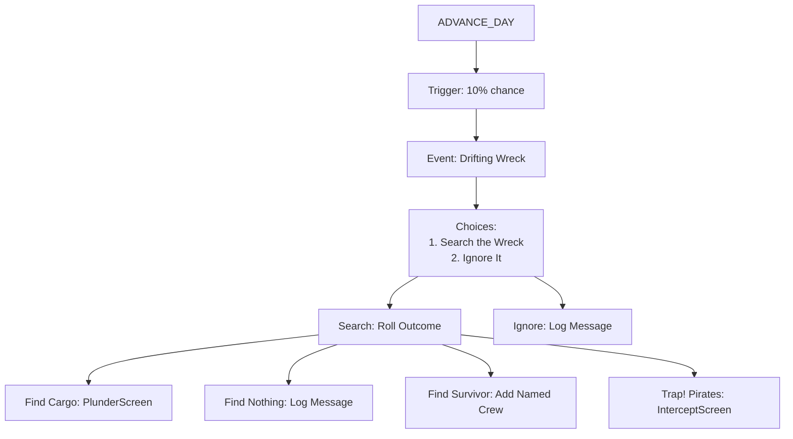
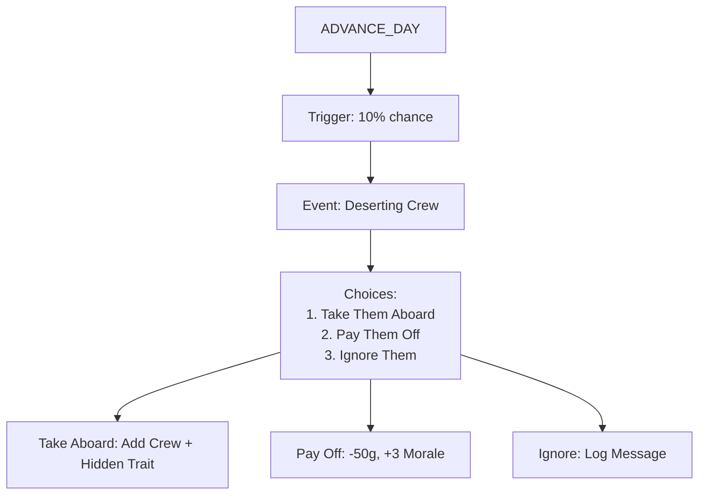

# tasks.md — New Random Events Implementation

**Broadside Game Engine**  
*Repository: papaladin/broadside*  
*Scope: Random Events Expansion (Post-T2.4)*  
*Last Updated: May 28, 2026*

---

## 📌 **Overview**

This document outlines the **implementation plan** for new random event types, ranked by **value-per-effort ratio**. Each event is analyzed for:

- **Mechanics Impact**: New systems vs. reused existing ones.
- **File Changes**: Which files need modifications.
- **Flow & Screens**: User journey through the event.
- **Complexity**: Estimated effort (Low/Medium/High).

**Prioritization Criteria:**

1. **Reuse of existing systems** (e.g., `generateEnemyCargo`, intercept screen).
2. **Tangible player feedback** (avoid "invisible" benefits like reduced patrol risk).
3. **Narrative depth** (events that feel alive and reactive).
4. **Dependencies**: Minimal blocking on other features.

---

## 🎯 **Implementation Priority**

*(Recommended Order: Highest Flavor/Effort Ratio First)*

### **🥇 Tier 1: Immediate (High Value, Low Effort)**


| Event              | Complexity | Est. Time | Mechanics Reused                       | New Mechanics Needed |
| ------------------ | ---------- | --------- | -------------------------------------- | -------------------- |
| **Drifting Wreck** | Low        | 2 hours   | `generateEnemyCargo`, intercept screen | None                 |
| **Deserting Crew** | Low        | 1 hour    | Crew state, traits (T4.1 prep)         | None                 |
| **Pirate Parley**  | Medium     | 3-4 hours | Reputation, missions, infamy           | Rumour stub          |


---

---

## 📋 **1. Drifting Wreck** *(Tier 1: Highest Priority)*

**Why?** Pure event, **zero new mechanics**, high flavor. Reuses `generateEnemyCargo` and intercept screen for the "trap" variant.

### **🎯 Event Flow**



### **📝 Specifications**

- **Trigger**: 10% chance per `ADVANCE_DAY` (same as existing events).
- **Condition**: Always (no restrictions).
- **Choices**:
  1. **Search the Wreck** (70% chance of reward, 30% chance of trap):
    - **Find Cargo** (50%): Open **PlunderScreen** with `G.generateEnemyCargo(enemy, "low")` (simulate a small merchant).
    - **Find Nothing** (20%): Log: "The wreck is empty. Looters have been here before."
    - **Find Survivor** (20%): Add a **named crew member** with a pre-set scar (e.g., `"shipwreck_survivor"`).
    - **Trap!** (10%): Spawn **pirate intercept** (2-4 pirates, low risk).
  2. **Ignore It**: Log: "You leave the wreck to the mercy of the sea."

### **🔧 Technical Impact**

#### **Files to Modify**


| File                 | Change Type           | Details                                                                   |
| -------------------- | --------------------- | ------------------------------------------------------------------------- |
| `data.js`            | Add event             | New entry in `RANDOM_EVENTS` array.                                       |
| `logic.js`           | None (reuse existing) | Use `G.generateEnemyCargo` for cargo, `L.buildEncounterContext` for trap. |
| `engine.js`          | None                  | Existing `maybeRandomEvent` handles new event.                            |
| `screens_voyage.jsx` | None                  | Reuse `PlunderScreen` and `InterceptScreen`.                              |


#### **New Data**

```javascript
// In data.js: RANDOM_EVENTS
{
  id: "drifting_wreck",
  type: "choice",
  title: "Drifting Wreck",
  desc: "A damaged ship drifts in the current. Its hull is split, and its sails hang in tatters. The nameplate reads 'The [Random Name]'.",
  choices: [
    {
      label: "Search the wreck",
      outcome: {
        action: "RESOLVE_DRIFTING_WRECK",
        log: "You approach cautiously..."
      }
    },
    {
      label: "Leave it be",
      outcome: {
        log: "You leave the wreck to the mercy of the sea."
      }
    }
  ]
}
```

#### **New Action**

```javascript
// In engine.js: Actions
A.RESOLVE_DRIFTING_WRECK: "RESOLVE_DRIFTING_WRECK"

// In engine.js: Reducer
case A.RESOLVE_DRIFTING_WRECK: {
  const roll = Math.random();
  if (roll < 0.50) {
    // Find cargo: Generate plunder from a small merchant
    const enemy = { faction: "english", hull: 50, cannons: 4, crew: 10 };
    const { cargo, gold } = G.generateEnemyCargo(enemy, "low");
    return {
      ...state,
      activeEvent: null,
      encounterContext: null,
      battleState: null,
      plunderState: { cargo, gold, source: "wreck" }, // Reuse PlunderScreen
      screen: "plunder",
      log: [...state.log, "You find salvageable cargo in the wreck!"]
    };
  } else if (roll < 0.70) {
    // Find nothing
    return {
      ...state,
      activeEvent: null,
      log: [...state.log, "The wreck is empty. Looters have been here before."]
    };
  } else if (roll < 0.90) {
    // Find survivor
    const crewMember = G.generateCrewMember("english", state.crew.roster.map(c => `${c.firstName} ${c.lastName}`));
    crewMember.scars = ["shipwreck_survivor"];
    return {
      ...state,
      activeEvent: null,
      crew: {
        ...state.crew,
        roster: [...state.crew.roster, crewMember]
      },
      log: [...state.log, `You rescue ${crewMember.firstName} ${crewMember.lastName}, a survivor of the wreck!`]
    };
  } else {
    // Trap: Pirates!
    const enemy = G.generateEnemy("low", state.fame, "pirate");
    enemy.name = "Wreck Looters";
    const context = L.buildEncounterContext(state, "wreck_trap", enemy);
    return {
      ...state,
      activeEvent: null,
      encounterContext: context,
      screen: "intercept",
      log: [...state.log, "As you board, pirates emerge from the hold — they got here first!"]
    };
  }
}
```

### **🎨 Screens Used**

- **EventScreen**: Displays the event and choices.
- **PlunderScreen**: Reused for cargo looting (if found).
- **InterceptScreen**: Reused for pirate trap.

### **📊 Complexity Breakdown**


| Task                      | Effort  | Files       | Notes                      |
| ------------------------- | ------- | ----------- | -------------------------- |
| Add event to `data.js`    | Low     | `data.js`   | Copy-paste template.       |
| Add action to `engine.js` | Low     | `engine.js` | New action + reducer case. |
| Test event flow           | Low     | `tests/`    | Verify all 4 outcomes.     |
| **Total**                 | **Low** | -           | ~2 hours                   |


---

---

## 📋 **2. Deserting Crew** *(Tier 1: High Narrative Value)*

**Why?** Pure event, **connects to T4.1 (Crew Traits)**. Sets up emotional payoff for the trait system.

### **🎯 Event Flow**



### **📝 Specifications**

- **Trigger**: 10% chance per `ADVANCE_DAY`.
- **Condition**: Always (or `fame >= 20` to avoid early-game spam).
- **Choices**:
  1. **Take Them Aboard**:
    - Add **2-3 crew members** (random faction, but prefer player’s current port faction).
    - **Hidden Trait**: 1 of the new crew has a **hidden negative trait** (e.g., `troublemaker`, `coward`, `drunkard`).
    - Log: "You take the sailors aboard. They seem grateful... for now."
  2. **Pay Them Off**:
    - Cost: **50g**.
    - Morale: **+3** (crew approves of mercy).
    - Log: "You give them gold for passage to the next port. The crew approves of your mercy."
  3. **Ignore Them**:
    - Log: "You leave them to their fate. The crew murmurs in disapproval."
    - **Optional**: -1 morale (if you want consequence).

### **🔧 Technical Impact**

#### **Files to Modify**


| File        | Change Type          | Details                                |
| ----------- | -------------------- | -------------------------------------- |
| `data.js`   | Add event            | New entry in `RANDOM_EVENTS`.          |
| `engine.js` | Add action + reducer | New `A.RESOLVE_DESERTING_CREW` action. |
| `logic.js`  | None                 | Reuse `G.generateCrewMember`.          |


#### **New Data**

```javascript
// In data.js: RANDOM_EVENTS
{
  id: "deserting_crew",
  type: "choice",
  title: "Deserting Crew",
  desc: "A small boat hails you. Three sailors, sunburnt and desperate, beg for passage. 'Our captain was a tyrant,' one says. 'We’d rather take our chances with the sea.'",
  choices: [
    {
      label: "Take them aboard",
      outcome: {
        action: "RESOLVE_DESERTING_CREW",
        choice: "take"
      }
    },
    {
      label: "Pay them to go away (50g)",
      outcome: {
        action: "RESOLVE_DESERTING_CREW",
        choice: "pay"
      }
    },
    {
      label: "Ignore them",
      outcome: {
        action: "RESOLVE_DESERTING_CREW",
        choice: "ignore"
      }
    }
  ]
}
```

#### **New Action**

```javascript
// In engine.js: Actions
A.RESOLVE_DESERTING_CREW: "RESOLVE_DESERTING_CREW"

// In engine.js: Reducer
case A.RESOLVE_DESERTING_CREW: {
  const { choice } = action;
  if (choice === "take") {
    // Add 2-3 crew members, one with a hidden trait
    const count = 2 + Math.floor(Math.random() * 2); // 2 or 3
    const newMembers = [];
    const hiddenTraitPool = ["troublemaker", "coward", "drunkard", "greedy"];
    const portFaction = D.PORTS[state.currentPort]?.faction || "pirate";
    
    for (let i = 0; i < count; i++) {
      const member = G.generateCrewMember(portFaction, state.crew.roster.map(c => `${c.firstName} ${c.lastName}`));
      if (i === 0 && Math.random() < 0.7) { // 70% chance one has a hidden trait
        member.hiddenTraits = [pickRandom(hiddenTraitPool)];
      }
      newMembers.push(member);
    }
    
    return {
      ...state,
      activeEvent: null,
      crew: {
        ...state.crew,
        roster: [...state.crew.roster, ...newMembers]
      },
      log: [...state.log, `You take ${count} sailors aboard. They seem grateful... for now.`]
    };
  } else if (choice === "pay") {
    return {
      ...state,
      activeEvent: null,
      gold: state.gold - 50,
      crew: {
        ...state.crew,
        morale: Math.min(100, state.crew.morale + 3)
      },
      log: [...state.log, "You give them gold for passage. The crew approves of your mercy."]
    };
  } else { // ignore
    return {
      ...state,
      activeEvent: null,
      log: [...state.log, "You leave them to their fate."]
    };
  }
}
```

### **🎨 Screens Used**

- **EventScreen**: Displays the event and choices.

### **📊 Complexity Breakdown**


| Task                      | Effort  | Files       | Notes                          |
| ------------------------- | ------- | ----------- | ------------------------------ |
| Add event to `data.js`    | Low     | `data.js`   | Copy-paste template.           |
| Add action to `engine.js` | Low     | `engine.js` | New action + reducer case.     |
| Add hidden traits to crew | Low     | `engine.js` | Extend crew member generation. |
| Test event flow           | Low     | `tests/`    | Verify all 3 outcomes.         |
| **Total**                 | **Low** | -           | ~1 hour                        |


---

---

## 📋 **3. Pirate Parley** *(Tier 1: Rich Interaction)*

**Why?** Touches **reputation, infamy, missions, and rumours**. Builds the sense of being "known" in the Caribbean.

### **🎯 Event Flow**

```mermaid
graph TD
    A[ADVANCE_DAY] --> B[Trigger: 10% chance]
    B --> C{Condition: pirate rep >= 40?}
    C -->|Yes| D[Event: Pirate Parley]
    C -->|No| E[Skip]
    D --> F[Choices:
        1. Parley (Exchange Info)
        2. Trade Goods
        3. Recruit Crew
        4. Decline]
    F --> G1[Parley: Gain Rumour]
    F --> G2[Trade: Quick Barter]
    F --> G3[Recruit: Add Pirate Crew]
    F --> G4[Decline: Log Message]
```

### **📝 Specifications**

- **Trigger**: 10% chance per `ADVANCE_DAY`.
- **Condition**: `state.reputation[piratePort] >= 40` (player is known to pirates).
- **Choices**:
  1. **Parley (Exchange Info)**:
    - Gain **1 rumour** (preview of next port’s prices or a world event hint).
    - Log: "The pirates share news: '[rumour text]'."
    - **Stub for Rumour System**: For now, generate a simple string like "Rum has it the Spanish are hunting a treasure fleet near Cartagena."
  2. **Trade Goods**:
    - **Quick Barter**: Exchange **1 good type** at **base price** (no markup).
    - Player selects **1 good** from their hold to trade for **1 good** from the pirate’s stock.
    - Pirate stock: 3-5 random goods (use `G.generatePortMarket` for a pirate port).
    - Log: "You trade [X] [good1] for [Y] [good2] at fair prices."
  3. **Recruit Crew**:
    - Add **1 pirate crew member** (random name, pirate faction).
    - **Hidden Trait**: 50% chance of a hidden trait (e.g., `veteran`, `greedy`).
    - Cost: **Free** (or optional: 20g bribe).
    - Log: "A pirate sailor joins your crew. Time will tell if they’re loyal."
  4. **Decline**:
    - Log: "You refuse to engage. The pirates sneer but let you pass."
    - **Optional**: -2 pirate reputation (if you want consequence).

### **🔧 Technical Impact**

#### **Files to Modify**


| File                 | Change Type            | Details                                          |
| -------------------- | ---------------------- | ------------------------------------------------ |
| `data.js`            | Add event              | New entry in `RANDOM_EVENTS`.                    |
| `engine.js`          | Add action + reducer   | New `A.RESOLVE_PIRATE_PARLEY` action.            |
| `generators.js`      | Add helper function    | `G.generatePirateBarter(state)` for quick trade. |
| `logic.js`           | Add helper function    | `L.generateRumour(state)` (stub for now).        |
| `screens_voyage.jsx` | Add mini-market screen | Reuse `MarketScreen` logic for barter.           |


#### **New Data**

```javascript
// In data.js: RANDOM_EVENTS
{
  id: "pirate_parley",
  type: "choice",
  title: "Pirate Parley",
  desc: "A pirate vessel closes but doesn’t attack. A flag signals parley. 'We’ve heard of you, Captain,' their quartermaster calls. 'Care to talk?'",
  condition: (state) => {
    // Check pirate reputation (average across pirate ports)
    const piratePorts = Object.keys(D.PORTS).filter(k => D.PORTS[k].faction === "pirate");
    const avgRep = piratePorts.reduce((sum, k) => sum + (state.reputation[k] || 0), 0) / piratePorts.length;
    return avgRep >= 40;
  },
  choices: [
    {
      label: "Parley — exchange information",
      outcome: {
        action: "RESOLVE_PIRATE_PARLEY",
        choice: "parley"
      }
    },
    {
      label: "Trade goods",
      outcome: {
        action: "RESOLVE_PIRATE_PARLEY",
        choice: "trade"
      }
    },
    {
      label: "Recruit from their crew",
      outcome: {
        action: "RESOLVE_PIRATE_PARLEY",
        choice: "recruit"
      }
    },
    {
      label: "Decline",
      outcome: {
        action: "RESOLVE_PIRATE_PARLEY",
        choice: "decline"
      }
    }
  ]
}
```

#### **New Functions**

```javascript
// In generators.js
const generatePirateBarter = (state) => {
  const piratePorts = Object.keys(D.PORTS).filter(k => D.PORTS[k].faction === "pirate");
  const portKey = pickRandom(piratePorts);
  const market = G.generatePortMarket(portKey);
  // Pick 3-5 random goods from the market
  const goods = Object.keys(market.goods)
    .filter(good => Math.random() < 0.5) // 50% chance per good
    .slice(0, 5); // Max 5 goods
  return goods.reduce((acc, good) => {
    acc[good] = { 
      buyPrice: market.goods[good].basePrice, 
      sellPrice: market.goods[good].basePrice,
      available: Math.floor(Math.random() * 10) + 1 // 1-10 units
    };
    return acc;
  }, {});
};

// In logic.js (stub for rumour system)
const generateRumour = (state) => {
  const portKeys = Object.keys(D.PORTS);
  const portKey = pickRandom(portKeys);
  const port = D.PORTS[portKey];
  const good = pickRandom(Object.keys(D.RESOURCES));
  const price = D.RESOURCES[good].basePrice * (0.8 + Math.random() * 0.4);
  return `Rum has it ${D.RESOURCES[good].name} is selling for ${Math.round(price)}g in ${port.name}.`;
};
```

#### **New Action**

```javascript
// In engine.js: Actions
A.RESOLVE_PIRATE_PARLEY: "RESOLVE_PIRATE_PARLEY"

// In engine.js: Reducer
case A.RESOLVE_PIRATE_PARLEY: {
  const { choice } = action;
  if (choice === "parley") {
    const rumour = L.generateRumour(state);
    return {
      ...state,
      activeEvent: null,
      log: [...state.log, `The pirates share news: "${rumour}"`]
    };
  } else if (choice === "trade") {
    const barterGoods = G.generatePirateBarter(state);
    return {
      ...state,
      activeEvent: null,
      barterState: { goods: barterGoods, source: "pirate_parley" },
      screen: "barter" // Reuse MarketScreen logic
    };
  } else if (choice === "recruit") {
    const member = G.generateCrewMember("pirate", state.crew.roster.map(c => `${c.firstName} ${c.lastName}`));
    if (Math.random() < 0.5) {
      member.hiddenTraits = [pickRandom(["veteran", "greedy", "drunkard"])];
    }
    return {
      ...state,
      activeEvent: null,
      crew: {
        ...state.crew,
        roster: [...state.crew.roster, member]
      },
      log: [...state.log, `A pirate sailor joins your crew. Time will tell if they’re loyal.`]
    };
  } else { // decline
    return {
      ...state,
      activeEvent: null,
      reputation: L.updateReputation(state, "tortuga", -2), // Example: -2 rep with Tortuga
      log: [...state.log, "You refuse to engage. The pirates sneer but let you pass."]
    };
  }
}
```

### **🎨 Screens Used**

- **EventScreen**: Displays the event and choices.
- **MarketScreen** (modified): Reused for barter trade (simplified UI).

### **📊 Complexity Breakdown**


| Task                           | Effort     | Files                       | Notes                         |
| ------------------------------ | ---------- | --------------------------- | ----------------------------- |
| Add event to `data.js`         | Low        | `data.js`                   | Copy-paste template.          |
| Add helper functions           | Medium     | `generators.js`, `logic.js` | Barter and rumour generation. |
| Add action to `engine.js`      | Medium     | `engine.js`                 | New action + reducer case.    |
| Modify MarketScreen for barter | Medium     | `screens_port.jsx`          | Simplified barter UI.         |
| Test event flow                | Medium     | `tests/`                    | Verify all 4 outcomes.        |
| **Total**                      | **Medium** | -                           | ~3-4 hours                    |


---

---

## 📋 **Deferred Ideas** *(Lower Priority or Higher Complexity)*

### **🔹 Passing Naval Escort** *(Deferred: Invisible Benefit)*

**Issue**: "Reduced patrol risk for 2 days" is **invisible** to the player.

#### **Requirements**

- **New State Field**: `state.escortedBy = { faction, daysRemaining }`.
- **New Logic**:
  - Modify `L.maybeRandomPatrol` and `maybeSmugglePatrol` to check `state.escortedBy`.
  - Decrement `daysRemaining` in `ADVANCE_DAY`.
- **New UI**: Display escort status in `SailingScreen` (e.g., "⛵ Escorted by English Navy (1 day remaining)").
- **New Mechanics**: None (reuses existing patrol logic).

#### **Files to Modify**


| File                 | Change Type                     |
| -------------------- | ------------------------------- |
| `engine.js`          | Add state field + reducer logic |
| `logic.js`           | Modify patrol chance functions  |
| `screens_voyage.jsx` | Add UI for escort status        |
| `data.js`            | Add event                       |


#### **Complexity**: Medium (3-4 hours)

---

### **🔹 Merchant Convoy** *(Deferred: Await Intercept Market Routing)*

**Issue**: "Join convoy" has **invisible benefit** (slower travel, protected). "Trade with them" is **high value** but requires **intercept → mini-market → sailing** routing.

#### **Requirements**

- **New State Field**: `state.convoyActive = { faction, speedPenalty, protection: true }`.
- **New Logic**:
  - Modify `L.travelDays` to apply `speedPenalty` (e.g., ×1.2 days).
  - Modify `maybeRandomPatrol` to skip if `state.convoyActive.protection === true`.
  - Generate **temporary market** for "Trade with Convoy" (reuse `G.generatePortMarket`).
- **New UI**: Display convoy status in `SailingScreen`.
- **New Screens**: Reuse `MarketScreen` for convoy trade.

#### **Files to Modify**


| File                 | Change Type                      |
| -------------------- | -------------------------------- |
| `engine.js`          | Add state field + reducer logic  |
| `logic.js`           | Modify travelDays + patrol logic |
| `screens_voyage.jsx` | Add UI for convoy status         |
| `screens_port.jsx`   | Reuse for convoy market          |
| `data.js`            | Add event                        |


#### **Complexity**: Medium (4-5 hours)

---

### **🔹 Suspicious Cargo Offer** *(Deferred: Requires "Stolen Goods" Flag)*

**Issue**: Requires **new mechanic** (`stolen` flag on hold items) or simplification (treat as contraband).

#### **Requirements**

- **Option A (Simple)**: Treat all purchased goods as **contraband** (reuse existing `illegal` logic).
- **Option B (Complex)**: Add `stolen: boolean` to hold items, with separate inspection logic.
- **New Event**: Add to `RANDOM_EVENTS`.
- **New UI**: None (reuse `MarketScreen` for trade).

#### **Files to Modify**


| File        | Change Type                        |
| ----------- | ---------------------------------- |
| `data.js`   | Add event                          |
| `engine.js` | Add action + reducer logic         |
| `logic.js`  | Modify contraband inspection logic |


#### **Complexity**: Medium (3 hours)

---

### **🔹 Stranded Governor’s Agent** *(Deferred: Passenger Missions)*

**Issue**: Requires **passenger mission system** (not yet implemented).

#### **Requirements**

- **New Mission Type**: `passenger` (deliver NPC to port within N days).
- **New State Field**: `state.passengers = [{ npc, targetPort, daysRemaining, reward }]`.
- **New Logic**:
  - Generate **pre-defined passenger mission** on event choice.
  - Auto-accept and track in `activeMission` or new `passengers` array.
  - Reward: **Gold + reputation** on delivery.
- **New UI**: Display passenger in `StatusScreen` or `SailingScreen`.

#### **Files to Modify**


| File               | Change Type                     |
| ------------------ | ------------------------------- |
| `data.js`          | Add event + mission type        |
| `generators.js`    | Add passenger mission generator |
| `engine.js`        | Add state field + reducer logic |
| `screens_port.jsx` | Add passenger UI                |
| `logic.js`         | Add passenger validation logic  |


#### **Complexity**: High (5+ hours)

---

### **🔹 Pirate Parley (Infamy Variant)** *(Deferred: Await T4.1)*

**Extension**: If `infamy >= 50`, pirates offer **smuggling mission directly** (no port visit needed).

#### **Requirements**

- **New Logic**: Generate smuggling mission on parley choice if `infamy >= 50`.
- **New UI**: Reuse `MissionScreen` for mission details.

#### **Files to Modify**


| File            | Change Type                    |
| --------------- | ------------------------------ |
| `engine.js`     | Modify `RESOLVE_PIRATE_PARLEY` |
| `generators.js` | Reuse `generateSmuggleMission` |


#### **Complexity**: Low (1 hour, but deferred to align with T4.1)

---

### **🔹 Damaged Merchant Seeking Escort** *(Deferred: Mission Wrapper)*

**Issue**: Can be implemented as a **parametric escort mission** (no new mechanics).

#### **Requirements**

- **New Event**: Add to `RANDOM_EVENTS`.
- **New Logic**: Generate **escort mission** on "Accept" choice, auto-accept.
- **New UI**: Reuse existing mission flow.

#### **Files to Modify**


| File            | Change Type                           |
| --------------- | ------------------------------------- |
| `data.js`       | Add event                             |
| `engine.js`     | Add action + reducer logic            |
| `generators.js` | Reuse `generateMission` (escort type) |


#### **Complexity**: Low (1-2 hours)

---

---

## 📊 **Summary Table**


| Event                | Priority | Complexity | Est. Time | Mechanics Reused                       | New Mechanics Needed     | Dependencies             |
| -------------------- | -------- | ---------- | --------- | -------------------------------------- | ------------------------ | ------------------------ |
| **Drifting Wreck**   | ⭐⭐⭐      | Low        | 2 hours   | `generateEnemyCargo`, intercept screen | None                     | None                     |
| **Deserting Crew**   | ⭐⭐⭐      | Low        | 1 hour    | Crew state, traits                     | Hidden traits stub       | None                     |
| **Pirate Parley**    | ⭐⭐⭐      | Medium     | 3-4 hours | Reputation, missions, infamy           | Rumour stub, barter UI   | None                     |
| Passing Naval Escort | ⭐        | Medium     | 3-4 hours | Patrol logic                           | `state.escortedBy`, UI   | None                     |
| Merchant Convoy      | ⭐        | Medium     | 4-5 hours | Market system, patrol logic            | `state.convoyActive`, UI | Intercept market routing |
| Suspicious Cargo     | ⭐        | Medium     | 3 hours   | Market/hold/contraband                 | "Stolen goods" flag      | None                     |
| Stranded Governor’s  | ⭐        | High       | 5+ hours  | Mission system                         | Passenger system         | Passenger missions       |
| Damaged Merchant     | ⭐⭐       | Low        | 1-2 hours | Mission system                         | None                     | None                     |


---

## 🎯 **Recommended Implementation Plan**

### **Phase 1: Quick Wins (1 Week)**

1. **Drifting Wreck** (2 hours)
  - Test: Verify all 4 outcomes (cargo, nothing, survivor, trap).
2. **Deserting Crew** (1 hour)
  - Test: Verify crew addition + hidden traits.
3. **Pirate Parley** (3-4 hours)
  - Test: Verify all 4 choices + rumour stub.

### **Phase 2: Medium Effort (2-3 Weeks)**

4. **Damaged Merchant Seeking Escort** (1-2 hours)
  - Test: Verify mission generation + auto-accept.
5. **Suspicious Cargo Offer** (3 hours)
  - Test: Verify contraband flagging + patrol risk.

### **Phase 3: Deferred (Post-T4.1)**

6. **Passing Naval Escort** (3-4 hours)
7. **Merchant Convoy** (4-5 hours)
8. **Stranded Governor’s Agent** (5+ hours)

---

## 🔗 **Cross-File Dependencies**


| File                 | Used By                           | Modified For                         |
| -------------------- | --------------------------------- | ------------------------------------ |
| `data.js`            | All                               | New events                           |
| `engine.js`          | All                               | New actions, state fields, reducers  |
| `logic.js`           | Pirate Parley, Naval Escort       | New helper functions                 |
| `generators.js`      | Drifting Wreck, Pirate Parley     | New helper functions                 |
| `screens_voyage.jsx` | Drifting Wreck, Pirate Parley     | Reuse PlunderScreen, InterceptScreen |
| `screens_port.jsx`   | Merchant Convoy, Suspicious Cargo | Reuse MarketScreen for barter        |


---

## 🧪 **Testing Requirements**

Each event must include:

1. **Unit Tests**:
  - Event triggering conditions.
  - Outcome logic (e.g., `generateEnemyCargo` for Drifting Wreck).
2. **Integration Tests**:
  - Full flow: Trigger → Choice → Outcome → State Update.
3. **UI Tests**:
  - Verify screens render correctly (EventScreen, PlunderScreen, etc.).

---

## 📝 **Notes for Implementation**

### **Reuse Over Reinvention**

- **PlunderScreen**: Already handles cargo allocation. Reuse for Drifting Wreck.
- **InterceptScreen**: Already handles enemy encounters. Reuse for Drifting Wreck trap.
- **MarketScreen**: Can be adapted for Pirate Parley barter and Merchant Convoy trade.
- **Mission System**: Can generate escort/passenger missions on-the-fly.

### **State Management**

- **Avoid new state fields** where possible (e.g., use `activeEvent` for temporary data).
- **Persistent state** (e.g., `escortedBy`, `convoyActive`) requires:
  - Migration patches (if adding to existing saves).
  - UI updates to display status.

### **Player Feedback**

- **Avoid invisible benefits** (e.g., reduced patrol risk without UI feedback).
- **Explicit logs**: "You sail under English colours — Spanish patrols give you a wide berth."
- **Visual cues**: Icons or text in SailingScreen for active effects.

---

## 🚀 **Next Steps**

1. **Start with Drifting Wreck**: Lowest effort, highest payoff.
2. **Add Deserting Crew**: Connects to T4.1 emotionally.
3. **Implement Pirate Parley**: Richest interaction, sets up future systems.

Would you like me to **generate a detailed task list for Phase 1** (Drifting Wreck + Deserting Crew + Pirate Parley)?