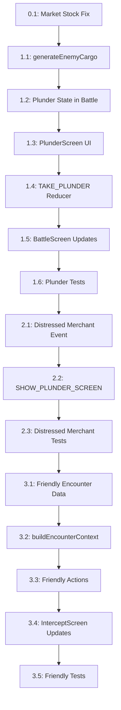

# Broadside — T2.3 & T2.4 Task List

## Plunder Screen, Friendly Encounters, Distressed Merchant Event & Market Stock Fix

---

### 📌 **Overview**

This document outlines the **dependency-ordered task list** for implementing:

- **T2.4: Plunder Screen** (post-grapple boarding)
- **T2.3: Friendly Encounter Types** (non-hostile intercepts)
- **Distressed Merchant Event** (transition to plunder)
- **Market Stock Depletion Fix** (bug: quantities not updating after purchase)

**Repository**: `[papaladin/broadside](https://github.com/papaladin/broadside)`  
**Scope**: Combat consequences, emergent storytelling, and bug fixes.

---

## 🗺️ **Dependency Graph**



---

## 📋 **Phase 0: Market Stock Depletion Fix** *(Foundation)*

> **Must ship first.** Fixes the bug where port stock quantities don’t update after purchase.

---

### ✅ **Task 0.1: Fix Market Stock Depletion Bug**

- **Where**: `engine.js` (reducer: `CONFIRM_TRADE`)
- **What**:
  - Decrement `state.portMarket.goods[good].available` by the purchased quantity in the `CONFIRM_TRADE` reducer.
  - Ensure the market is regenerated fresh on `ENTER_PORT` (already implemented in `G.generatePortMarket`).
- **Validation**:
  - Test: Buy 40 rum → confirm → verify `available` decreases by 40.
  - Test: Leave and re-enter port → verify stock is reset to a new random value.
- **Files**:
  - `engine.js` (reducer)
  - `tests/` (add regression test for stock depletion)

---

---

## 📌 **Phase 1: Plunder Screen (T2.4)** *(Core System)*

> **Must ship before Friendly Encounters.** Implements post-grapple cargo allocation.

---

### 🛠️ **Task 1.1: Add `G.generateEnemyCargo` to `generators.js**`

- **Input**: `enemy` (object with `faction`, `hull`, `cannons`, `crew`), `risk` (`low`/`medium`/`high`/`assault`), `playerFame`
- **Output**: `{ gold: number, cargo: { [goodKey]: quantity } }`
- **Logic**:
  - **Gold**: Scale with `enemy.hull + enemy.cannons * 10 + enemy.crew * 5`, modified by `risk`:
    - `low`: ×0.8
    - `medium`: ×1.0
    - `high`: ×1.2
    - `assault`: ×1.4
  - **Cargo**:
    - **Always include**: `water` and `food` (quantity = `enemy.crew * 0.1` days’ worth).
    - **Faction probabilities**:

      | Faction | Primary Goods (Weight) | Secondary Goods (Weight)              | Contraband?         |
      | ------- | ---------------------- | ------------------------------------- | ------------------- |
      | Spanish | silver (60%)           | cocoa (30%), spices (10%)             | ❌                   |
      | Pirate  | rum (50%)              | weapons (30%), tobacco/slaves (20%)   | ✅ (tobacco, slaves) |
      | English | cloth (50%)            | weapons (30%), sugar (20%)            | ❌                   |
      | Dutch   | spices (40%)           | silk (30%), coffee (20%), cocoa (10%) | ❌                   |
      | French  | sugar (40%)            | cocoa (30%), rum (20%), coffee (10%)  | ❌                   |

    - **Quantity**: Base on ship size (derived from `enemy.cannons` via `L.guessShipType`):
      - Small (cutter/sloop): 5–15 units
      - Medium (brigantine/schooner): 15–40 units
      - Large (frigate/galleon): 40–100 units
    - **Risk modifier**: `high` → +20% cargo, `assault` → +50%.
- **Files**:
  - `generators.js` (new function)
  - `tests/` (unit test for cargo generation)

---

### 🎯 **Task 1.2: Add Plunder State to Battle Resolution**

- **Where**: `engine.js` (reducer: `BATTLE_ACTION` and `DISMISS_BATTLE`)
- **Changes**:
  1. In `resolveCombatAction` (`logic.js`):
    - On `grapple` victory, generate `enemyCargo` and `goldReward` using `G.generateEnemyCargo`.
    - Store in `battleState`: `{ enemyCargo, goldReward, canPlunder: true }`.
    - **Do not** award gold immediately (delay until plunder screen resolution).
  2. In `engine.js`:
    - Modify `DISMISS_BATTLE` to check `battleState.canPlunder`.
    - If `true`, route to **PlunderScreen** instead of returning to port/sailing.
    - Add new action: `TAKE_PLUNDER` (see Task 1.4).
- **Edge Cases**:
  - **Cannon victory** (enemy sunk) → **No plunder screen** (award gold immediately as before).
  - **Assault mission victory** → **No plunder screen** (mission gold only).
- **Files**:
  - `logic.js` (`resolveCombatAction`)
  - `engine.js` (`DISMISS_BATTLE`, new `TAKE_PLUNDER` action)

---

### 🖥️ **Task 1.3: Create PlunderScreen UI in `screens_voyage.jsx**`

- **Trigger**: When `battleState.phase === "victory"` **and** `battleState.canPlunder === true`.
- **Components**:
  - **Header**: "Plunder the [Enemy Name]" + faction pill.
  - **Enemy Cargo Table**:
    - Columns: **Good** | **Quantity Available** | **Your Hold Space** | **Take** (+/− buttons)
    - **Contraband warning**: Highlight tobacco/slaves in red with "⚠ Infamy +X" tooltip.
  - **Gold Reward Display**:
    - Show `goldReward` (50% if taking **any** cargo, 100% if sinking).
    - Dynamic update: If player takes cargo → gold display halves.
  - **Hold Visualization**:
    - Live bar showing current/max hold capacity.
    - Disable "+" buttons when hold is full.
  - **Actions**:
    - **"Take Cargo"**: Applies selected quantities to hold, awards 50% gold.
    - **"Sink Her"**: Awards 100% gold, no cargo, no infamy.
    - **"Board Later"**: *(Optional)* Return to victory screen (not recommended; adds complexity).
- **UX Notes**:
  - If hold is **completely full**, show warning: "Hold full — cannot take cargo. Sink her for gold?"
  - Pre-select "Sink Her" if hold is full.
- **Files**:
  - `screens_voyage.jsx` (new `PlunderScreen` component)
  - `ui.jsx` (reusable `Bar`/`Pill` components)

---

### 🔄 **Task 1.4: Add `TAKE_PLUNDER` Reducer Logic**

- **Action**: `{ type: A.TAKE_PLUNDER, cargoAllocation: { [goodKey]: quantity } }`
- **Reducer**:
  1. Add allocated cargo to `state.hold.items`.
  2. Apply infamy for contraband (use existing `L.applyLoseContraband` logic).
  3. Award gold:
    - If `cargoAllocation` is empty → 100% `goldReward`.
    - If `cargoAllocation` has items → 50% `goldReward`.
  4. Clear `battleState`, return to `returnScreen`.
  5. Log: `"Plundered [X] [good] from the [enemy]. +[Y] gold."`
- **Files**:
  - `engine.js` (new action + reducer case)
  - `logic.js` (helper to calculate final gold)

---

### 🎨 **Task 1.5: Update BattleScreen Victory UI**

- **Change**: Replace "Dismiss" button with:
  - **"Board and Plunder"** (if `canPlunder === true`)
  - **"Sink Her"** (always available, awards gold immediately)
- **Files**:
  - `screens_voyage.jsx` (`BattleScreen` component)

---

### 🧪 **Task 1.6: Add Plunder Tests**

- **Unit Tests**:
  - `G.generateEnemyCargo`:
    - Spanish galleon → high silver/cocoa probability.
    - Pirate sloop → contraband included.
    - Risk scaling (`low`/`medium`/`high`).
  - `TAKE_PLUNDER` reducer:
    - Hold space validation.
    - Gold halving when taking cargo.
    - Infamy for contraband.
- **Integration Test**:
  - Full flow: Grapple win → PlunderScreen → Take cargo → Verify hold/gold/infamy updates.

---

---

## 📌 **Phase 2: Distressed Merchant Event** *(Plunder Transition)*

> **Uses PlunderScreen infrastructure.** Ships after Phase 1.

---

### 🚢 **Task 2.1: Add Distressed Merchant to `RANDOM_EVENTS**`

- **New Event**:
  ```js
  {
    id: "distressed_merchant_plunder",
    type: "choice",
    title: "Merchant in Distress",
    desc: "A merchant ship is under attack by pirates! The crew signals for help.",
    condition: (state) => state.screen === "sailing" && Math.random() < 0.03,
    choices: [
      {
        label: "Rescue the Merchant",
        outcome: {
          log: "You drive off the pirates! The merchant rewards you.",
          gold: 200,
          repImpact: { [merchantFaction]: +5 },
          moraleBonus: +5
        }
      },
      {
        label: "Board and Plunder",
        outcome: {
          action: "SHOW_PLUNDER_SCREEN",
          enemy: { name: "Distressed Merchant", faction: "english", hull: 80, cannons: 6, crew: 20 },
          risk: "low",
          log: "You turn on the merchant! Their cargo is yours for the taking."
        }
      },
      {
        label: "Ignore and Sail On",
        outcome: {
          log: "You leave them to their fate.",
          repImpact: { [merchantFaction]: -5 }
        }
      }
    ]
  }
  ```
- **Files**:
  - `data.js` (new event in `RANDOM_EVENTS`)

---

### 🔗 **Task 2.2: Handle `SHOW_PLUNDER_SCREEN` in Reducer**

- **Action**: `{ type: A.SHOW_PLUNDER_SCREEN, enemy, risk }`
- **Reducer**:
  - Generate `enemyCargo` using `G.generateEnemyCargo(enemy, risk)`.
  - Set `state.encounterContext = null`, `state.battleState = null`.
  - Open PlunderScreen with the generated cargo.
- **Files**:
  - `engine.js` (new action + reducer case)

---

### 🧪 **Task 2.3: Test Distressed Merchant Flow**

- **Test**:
  - Trigger event → Choose "Board and Plunder" → Verify PlunderScreen opens with merchant cargo.

---

---

## 📌 **Phase 3: Friendly Encounters (T2.3)** *(Non-Hostile Intercepts)*

> **Uses InterceptScreen.** Ships after Plunder.

---

### 📜 **Task 3.1: Add Friendly Encounter Types to `data.js**`

- **New Encounter Types** (for `buildEncounterContext`):
  - `passing_naval_escort`:
    - **Options**: Accept (patrol risk halved for 2 days, +rep), Decline (no effect).
    - **Condition**: `state.reputation[faction] >= 60`.
  - `merchant_convoy`:
    - **Options**: Join (slower travel, protected), Trade (access convoy goods), Let Pass.
- **Files**:
  - `data.js` (new entries in `RANDOM_EVENTS` or encounter type config)

---

### 🛠️ **Task 3.2: Extend `buildEncounterContext` for Friendly Types**

- **Changes**:
  - Add logic to handle `passing_naval_escort` and `merchant_convoy` in `L.buildEncounterContext`.
  - **Options Array**:
    - For `passing_naval_escort`: "Accept Escort", "Decline".
    - For `merchant_convoy`: "Join Convoy", "Trade with Convoy", "Let Them Pass".
  - **Speed Checks**: Not applicable (no combat).
- **Files**:
  - `logic.js` (`buildEncounterContext`)

---

### 🔄 **Task 3.3: Add Friendly Encounter Actions to Reducer**

- **New Actions**:
  - `ACCEPT_ESCORT`: Set `state.escortActive = { faction, daysRemaining: 2 }`.
  - `JOIN_CONVOY`: Set `state.convoyActive = true`, modify `travelDays` (×1.2).
  - `TRADE_WITH_CONVOY`: Open a **temporary market** (use `G.generatePortMarket` with convoy-specific goods).
- **Files**:
  - `engine.js` (new actions + reducer cases)

---

### 🎨 **Task 3.4: Update InterceptScreen for Friendly Options**

- **Changes**:
  - Style friendly options differently (e.g., green border for "Accept Escort").
  - Add tooltips for consequences (e.g., "Join Convoy: +2 days travel, -50% patrol risk").
- **Files**:
  - `screens_voyage.jsx` (`InterceptScreen`)

---

### 🧪 **Task 3.5: Add Friendly Encounter Tests**

- **Unit Tests**:
  - `buildEncounterContext` for new types.
  - Reducer cases for `ACCEPT_ESCORT`, `JOIN_CONVOY`.
- **Integration Test**:
  - Trigger naval escort → Accept → Verify patrol risk reduction.

---

---

## 📋 **Deliverables Checklist**


| Phase | Task                      | Files Modified          | Tests Required | Status |
| ----- | ------------------------- | ----------------------- | -------------- | ------ |
| 0     | Market Stock Fix          | `engine.js`             | ✅              | ⬜      |
| 1     | `generateEnemyCargo`      | `generators.js`         | ✅              | ⬜      |
| 1     | Plunder State             | `logic.js`, `engine.js` | ✅              | ⬜      |
| 1     | PlunderScreen UI          | `screens_voyage.jsx`    | ✅              | ⬜      |
| 1     | `TAKE_PLUNDER` Reducer    | `engine.js`             | ✅              | ⬜      |
| 1     | BattleScreen Updates      | `screens_voyage.jsx`    | ✅              | ⬜      |
| 1     | Plunder Tests             | `tests/`                | ✅              | ⬜      |
| 2     | Distressed Merchant Event | `data.js`               | ✅              | ⬜      |
| 2     | `SHOW_PLUNDER_SCREEN`     | `engine.js`             | ✅              | ⬜      |
| 2     | Distressed Merchant Tests | `tests/`                | ✅              | ⬜      |
| 3     | Friendly Encounter Data   | `data.js`               | ✅              | ⬜      |
| 3     | `buildEncounterContext`   | `logic.js`              | ✅              | ⬜      |
| 3     | Friendly Actions          | `engine.js`             | ✅              | ⬜      |
| 3     | InterceptScreen Updates   | `screens_voyage.jsx`    | ✅              | ⬜      |
| 3     | Friendly Tests            | `tests/`                | ✅              | ⬜      |


---

## 📝 **Implementation Notes**

### 1. **PlunderScreen Reusability**

The same `PlunderScreen` component can be used for:

- Grapple victory plunder.
- Distressed merchant plunder (via `SHOW_PLUNDER_SCREEN`).
- Future variants (e.g., abandoned ship, captured port).

### 2. **Contraband Handling**

Reuse existing logic:

- `L.applyLoseContraband` (for seizures).
- `RESOURCES[good].infamyOnBuy` (for infamy gains).

### 3. **Gold Scaling**

Ensure `G.generateEnemyCargo` uses the same scaling logic as mission gold (`MISSION_GOLD_RANGES` in `data.js`).

### 4. **State Migration**

No new state fields require migration (all changes are additive or use existing structures).

### 5. **Design Decisions (from Your Answers)**

- **Plunder Trigger**: After grappling win, with "Board and Plunder" / "Sink Her" options.
- **Gold Reward**: Generated alongside cargo; 50% if taking cargo, 100% if sinking.
- **Cargo Generation**: Faction-based probabilities + ship size quantities + risk modifiers.
- **Contraband**: Only pirate enemies can carry tobacco/slaves.
- **Hold Full**: Player can always take gold; cargo is lost if no space.
- **Friendly Encounters**: Separate from Plunder; use InterceptScreen.

---

## 🚀 **Recommended Workflow**

1. **Start with Phase 0** (Market Fix) → Quick win, unblocks testing.
2. **Phase 1** (Plunder Core) → Focus on `generateEnemyCargo` + PlunderScreen.
3. **Phase 2** (Distressed Merchant) → Reuse PlunderScreen.
4. **Phase 3** (Friendly Encounters) → Expand InterceptScreen.

---

## 🔗 **References**

- [Repository: papaladin/broadside](https://github.com/papaladin/broadside)
- [Roadmap: T2.3 & T2.4](https://github.com/papaladin/broadside/blob/main/roadmap.md)
- [Architecture Docs](https://github.com/papaladin/broadside/blob/main/architecture.md)

